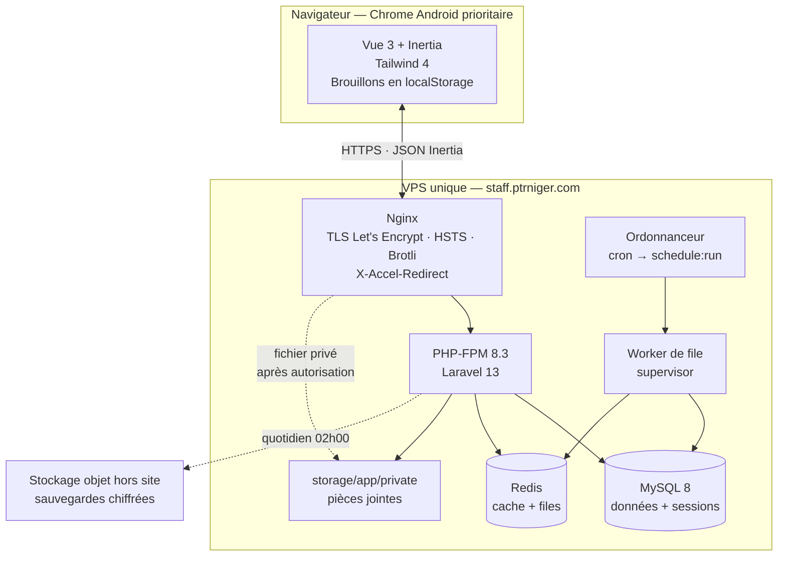
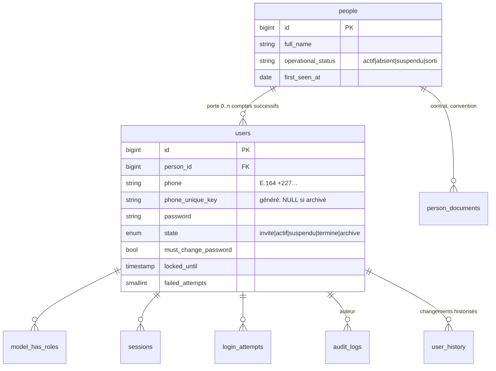
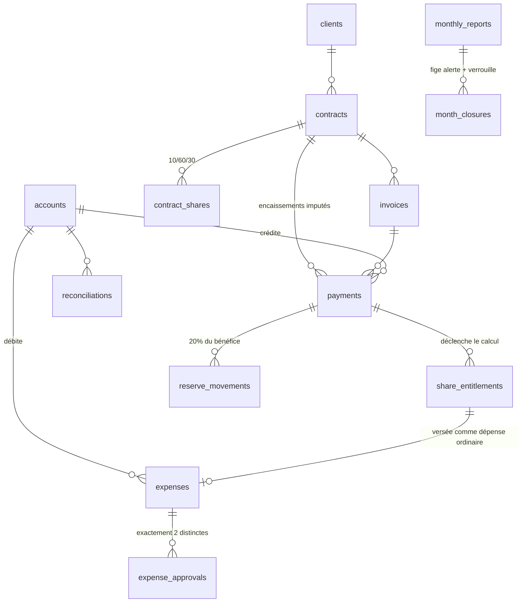

# PTR Staff — Architecture technique

**Version :** 1.0
**Date :** 18/07/2026
**Auteur :** Winston (agent Architect, BMAD)
**Entrées :** `docs/prd.md` (v4), `docs/front-end-spec.md`, `docs/brief.md`
**Sortie attendue :** shard vers `docs/architecture/` par l'agent PO

---

## 1. Objet et cadrage

Ce document fixe l'architecture technique de PTR Staff et tranche les décisions A-01 à A-07
laissées ouvertes par le § 8.4 du PRD.

**Contexte dimensionnant.** Application interne, mono-entreprise, 5 à 100 utilisateurs (NFR27),
aucun locataire multiple (NFR28), aucune intégration externe en MVP (§ 8.3), une équipe de
développement réduite. Toute la conception découle de ce cadrage : **le facteur limitant de ce
projet n'est pas la charge technique, c'est la charge de maintenance et l'exigence d'intégrité.**

Trois exigences structurent le document plus que toutes les autres :

| Exigence | Origine | Conséquence architecturale |
|---|---|---|
| Rien ne se supprime | P2, RM-17, NFR20 | L'immuabilité est une contrainte de schéma et de privilèges base, pas une convention de code |
| L'audit est transactionnel | NFR21 | L'écriture d'audit partage la transaction métier ; son échec annule l'opération |
| Le contrôle d'accès est serveur | P4, PERM-01, NFR14 | L'autorisation est testée par campagne automatisée rôle × route, pas déduite de l'affichage |

**Principe directeur retenu :** technologie ennuyeuse, un seul artefact déployable, aucune
abstraction introduite avant son deuxième usage réel. Les microservices, le CQRS, l'event sourcing
et le découpage en paquets Composer internes sont **écartés explicitement** : ils coûteraient plus
en maintenance qu'ils n'apportent à cette échelle.

---

## 2. Registre des décisions d'architecture

### 2.1 Décisions validées par la direction le 18/07/2026

| Réf. | Décision | Retenu | Statut |
|---|---|---|---|
| **A-01** | Intégration de Vue 3 | **Inertia.js 2 + Vue 3**, pas de SPA séparée, pas de SSR | ✅ Validé |
| **A-02** | Base de données de production | **MySQL 8.0 / MariaDB 10.11+** | ✅ Validé |
| **A-03** | Hébergement | **VPS unique, déploiement scripté** | ✅ Validé |

### 2.2 Décisions prises par l'Architecte dans le cadre du § 8.4

| Réf. | Décision | Retenu | § |
|---|---|---|---|
| A-04 | Stockage des pièces jointes | Disque privé `storage/app/private`, servi par contrôleur + `X-Accel-Redirect` | [§ 11](#11-pièces-jointes-privées) |
| A-05 | Immuabilité et versionnement | Triple barrière : privilèges SQL, déclencheurs base, trait applicatif | [§ 15](#15-immuabilité-historiques-et-annulations) |
| A-06 | Séparation personne / compte | Tables `people` et `users` distinctes dès l'Étape 1 | [§ 6.2](#62-noyau-identité--a-06--contra-02) |
| A-07 | Notifications | Système de notifications Laravel, canal `database` seul en MVP | [§ 9.4](#94-notifications-a-07) |

### 2.3 Décisions requérant votre accord — non définitives

> Ces onze points sont **proposés, pas figés**. Chacun porte une recommandation applicable en
> l'état ; un désaccord de votre part ne provoque aucune réécriture profonde de ce document.
> Ils sont regroupés et détaillés au [§ 26](#26-points-requérant-votre-accord).

| Réf. | Sujet | Recommandation |
|---|---|---|
| **DEC-01** | Fuseau de stockage des horodatages | UTC en base, `Africa/Niamey` à l'affichage |
| **DEC-02** | Base des tests automatisés | MySQL, et non SQLite, pour parité des déclencheurs |
| **DEC-03** | Dépendance `spatie/laravel-permission` | Retenue |
| **DEC-04** | Dépendance Redis | Retenue (cache et files), sessions en base |
| **DEC-05** | Emplacement de la préproduction | Même VPS, hôte virtuel distinct |
| **DEC-06** | Hébergeur des sauvegardes hors site | À choisir — la donnée quitte le Niger |
| **DEC-07** | Suivi des erreurs (Sentry ou fichiers seuls) | Sentry auto-hébergé, ou fichiers seuls |
| **DEC-08** | Q11 — types et taille des pièces jointes | PDF/JPEG/PNG/WebP/HEIC, 8 Mo |
| **DEC-09** | Q6 — comptes financiers réels à initialiser | Liste à fournir |
| **DEC-10** | Q9 — vérification d'identité à la réinitialisation | Procédure hors application à formaliser |
| **DEC-11** | Q12 — conservation 10 ans | Confirme NFR26 et le dimensionnement disque |

**Rappel PRD :** les contradictions CONTRA-01, 03, 04, 05 et 07 restent ouvertes. Aucune ne bloque
l'Étape 1. CONTRA-01 (régularisation des parts à la clôture de contrat) et CONTRA-04 (employé
apporteur) **doivent être tranchées avant l'écriture du modèle de données financier de l'Étape 4**.

---

## 3. Vue d'ensemble

### 3.1 Style architectural

**Monolithe modulaire, déployé en un artefact unique.** Laravel rend des pages Vue via Inertia ;
il n'existe ni API publique, ni frontend déployé séparément, ni service auxiliaire hors du serveur
de files d'attente qui est le même processus PHP.



### 3.2 Ce que l'architecture ne fait pas

Écarté délibérément, pour que ces absences ne soient pas relues plus tard comme des oublis :

- **Pas de microservices.** Quatre domaines faiblement couplés dans un monolithe, § 8.2 du PRD.
- **Pas de SSR Inertia.** Doublerait l'exploitation (processus Node à superviser) pour un gain nul :
  les 68 écrans sont derrière authentification, aucun besoin de référencement.
- **Pas de PWA, pas de service worker, pas de mode hors ligne.** Phase 2 (§ 3.2 du PRD). Le brouillon
  local du § 18 couvre le besoin réel du MVP sans en payer la complexité.
- **Pas de bibliothèque de composants Vue.** Décision UX § 6.1, imposée par NFR2 et NFR3.
- **Pas de conteneurisation en production.** Un VPS, un déploiement scripté. Docker sert uniquement
  à l'intégration continue.
- **Pas de multi-tenant, aucune colonne `tenant_id`.** NFR28. Question Q15 en suspens : si la
  direction revient sur ce point à deux ans, la reprise sera coûteuse et assumée comme telle.

---

## 4. Stack technique

| Couche | Choix | Version | Justification |
|---|---|---|---|
| Langage | PHP | 8.3 | Imposé § 8.3 |
| Framework | Laravel | 13.x | Imposé § 8.3, structure « slim » |
| Pont front | Inertia.js | 2.x | A-01 — routage et autorisation restent serveur |
| Front | Vue 3 (`<script setup>`) | 3.5+ | Imposé § 8.3 |
| Build | Vite | 8.x | Imposé § 8.3 |
| CSS | Tailwind CSS | 4.x | Imposé § 8.3, configuration CSS-first via `@theme` |
| BDD production | MySQL / MariaDB | 8.0 / 10.11+ | A-02 |
| BDD développement | SQLite | 3.x | § 8.3 — voir réserve DEC-02 |
| Cache et files | Redis | 7.x | DEC-04 |
| Sessions | MySQL (`database`) | — | Nécessaire à FR8 / PERM-08, voir § 9.3 |
| Serveur web | Nginx + PHP-FPM | — | A-03 |
| Permissions | `spatie/laravel-permission` | 6.x | DEC-03 |
| Sauvegarde | `spatie/laravel-backup` | 9.x | NFR24, NFR25 |
| Images | `intervention/image` | 3.x | Vignettes serveur (UX § 11.2) |
| Tests | PHPUnit | 12.x | Imposé par `coding-standards.md` |
| Tests E2E | Playwright | 1.x | Parcours critiques § 23.4 |
| Formatage | Laravel Pint | 1.x | Imposé par `coding-standards.md` |
| Analyse statique | Larastan (PHPStan) | 3.x | Niveau 6, voir § 23.1 |
| CI/CD | GitHub Actions | — | § 25 |

**Poids du parc de dépendances front en production :** Vue 3 runtime (~34 Ko gzip) + Inertia
(~10 Ko gzip) + code applicatif découpé par page. Budget vérifié en CI (§ 19.4).

---

## 5. Structure des modules

### 5.1 Principe

Le PRD recommande un découpage en modules internes (§ 8.2). Il est appliqué **par sous-dossiers de
namespace à l'intérieur de l'arborescence Laravel standard**, et non par paquets Composer ou
dossiers racine supplémentaires.

Raison : `php artisan make:*` est imposé par les standards du dépôt et fonctionne nativement avec
`make:model Finance/Expense`. Un découpage en paquets casserait cette ergonomie, imposerait un
autoloader dédié et ajouterait une couche de configuration pour un bénéfice nul à cette taille.
Cette structure **ne crée aucun dossier racine nouveau**, conformément à `source-tree.md`.

### 5.2 Les cinq modules

| Module | Périmètre | Étape | Objets principaux |
|---|---|---|---|
| **Platform** | Paramètres, audit, notifications, pièces jointes, calendrier | 1 | `Setting`, `AuditLog`, `Attachment`, `Holiday` |
| **Identity** | Personnes, comptes, rôles, sessions, organisation | 1 | `Person`, `User`, `Role`, `Absence`, `Department` |
| **Work** | Objectifs, projets, tâches, livrables | 2 | `Objective`, `Project`, `Task`, `Deliverable` |
| **Accountability** | Rapports, blocages, revues, stagiaires, documents | 3 | `DailyReport`, `Blocker`, `WeeklyReview`, `Internship` |
| **Finance** | Comptes, clients, contrats, encaissements, dépenses, parts, réserve, rapprochement, clôture | 1 *(dépenses)* et 4 | `Account`, `Contract`, `Payment`, `Expense`, `Share`, `Reserve` |

> **Dépendance à surveiller.** Le circuit de dépense à double approbation est livré à l'Étape 1
> alors que le module Finance est de l'Étape 4. `Expense` est donc créé dès l'Étape 1 **sans**
> imputation comptable ni compte financier, et enrichi à l'Étape 4 (FR115 vs FR123). Les migrations
> doivent le prévoir : colonnes financières ajoutées par migration ultérieure, jamais par
> modification de la migration d'origine.

### 5.3 Arborescence

```
app/
├── Console/Commands/            ptr:create-first-admin, ptr:test-restore
├── Http/
│   ├── Controllers/{Platform,Identity,Work,Accountability,Finance}/
│   ├── Requests/{…mêmes modules}/     Form Requests — validation exclusive
│   ├── Resources/                     API Resources (§ 10.4)
│   └── Middleware/                    EnsurePasswordChanged, EnsureAccountActive, …
├── Models/{Platform,Identity,Work,Accountability,Finance}/
├── Policies/{…mêmes modules}/         Une policy par modèle protégé
├── Services/{…mêmes modules}/         Logique métier transactionnelle
├── Support/
│   ├── Money.php                      Entiers XOF, formatage
│   ├── PhoneNumber.php                Normalisation +227
│   └── Auditing/                      AuditLogger, trait Auditable
├── Enums/                             États, niveaux d'alerte, types de compte
└── Observers/                         Filet de sécurité d'audit

resources/js/
├── app.js                             Amorçage Inertia
├── Layouts/                           AppLayout, AuthLayout
├── Pages/{Platform,Identity,Work,Accountability,Finance}/
├── Components/                        Les 18 composants du système de design UX
└── Composables/                       useDraft, useMoney, usePermissions
```

**Règle de couplage.** Un service d'un module peut lire les modèles d'un autre module, mais ne
peut pas écrire dedans : toute écriture inter-modules passe par le service propriétaire du modèle
cible. C'est la seule règle de découplage imposée — elle suffit à empêcher l'enchevêtrement sans
introduire d'interfaces ni d'injection de contrats.

---

## 6. Modèle de données

### 6.1 Règles transverses

| Règle | Application |
|---|---|
| Montants | `BIGINT UNSIGNED`, entiers XOF, cast `integer`. Aucun `DECIMAL`, aucun flottant (NFR22) |
| Horodatages | `TIMESTAMP` UTC (DEC-01) |
| Dates métier | `DATE`, calendrier civil `Africa/Niamey` — jamais converties |
| Clés | `BIGINT UNSIGNED` auto-incrémenté ; `UUID` public pour les objets exposés en URL sensible |
| Suppression | **Aucune table métier ne porte de `deleted_at`.** Voir § 15 |
| États | Colonnes `ENUM` adossées à des enums PHP typés |
| Audit | Toute table de FR21 est couverte par l'observateur d'audit |

### 6.2 Noyau identité — A-06 / CONTRA-02

La séparation **personne / compte applicatif** est structurelle dès l'Étape 1, même sans les
abonnements de phase 2 qui la motivaient (CONTRA-02). Elle sert immédiatement FR4 : le retour d'une
personne dans l'entreprise crée un nouveau compte rattaché à la fiche personne existante.



**FR3 — unicité du téléphone sur les comptes non archivés.** Résolue au niveau base, pas
applicatif, par colonne générée et index unique. MySQL et MariaDB n'indexent pas les valeurs
`NULL` en doublon, ce qui produit exactement la sémantique demandée :

```sql
ALTER TABLE users
  ADD COLUMN phone_unique_key VARCHAR(20)
    GENERATED ALWAYS AS (IF(state = 'archive', NULL, phone)) STORED,
  ADD UNIQUE INDEX users_phone_active_unique (phone_unique_key);
```

Un compte archivé libère donc son numéro (FR3), et l'historique reste porté par `people`.
Sous réserve de Q17 / CONTRA-09 : si la direction impose l'unicité permanente, l'index devient un
`UNIQUE` simple sur `phone` — changement d'une ligne de migration.

**Historisation (FR18).** Table `user_history` : `user_id`, `field`, `old_value`, `new_value`,
`changed_by`, `changed_at`, `reason`. Alimentée par le même service que l'audit, dans la même
transaction. Elle sert la consultation métier ; `audit_logs` sert le contrôle. Les deux coexistent
volontairement : `audit_logs` est fermé à tous sauf `direction` (FR23), alors que l'historique d'une
fiche doit rester lisible par le responsable.

### 6.3 Noyau financier



Points de conception notables :

- **`payments` et `expenses` ne sont jamais modifiés après validation.** Correction = nouvelle
  version liée ; annulation = contre-écriture liée. Voir § 15.
- **`share_entitlements`** matérialise le droit à une part (FR131) ; le **versement** est une
  `expense` ordinaire à deux signatures (FR134). Les deux sont liés, jamais confondus : un droit
  calculé n'est pas un paiement effectué.
- **`reserve_movements`** est un livre auxiliaire. Le montant de la réserve n'est jamais une colonne
  de solde : il est la somme du livre (§ 16).
- **`month_closures`** porte le verrou de clôture (FR158) et la trace de réouverture (FR159).
- **`accounts.opening_balance`** est la seule saisie directe de solde ; le solde courant est
  toujours calculé (FR100).

### 6.4 Journal d'audit

```sql
CREATE TABLE audit_logs (
  id            BIGINT UNSIGNED AUTO_INCREMENT PRIMARY KEY,
  actor_id      BIGINT UNSIGNED NULL,          -- NULL = système (amorçage, tâche planifiée)
  actor_label   VARCHAR(120) NOT NULL,          -- dénormalisé : survit à l'archivage du compte
  occurred_at   TIMESTAMP(3) NOT NULL,
  auditable_type VARCHAR(120) NOT NULL,
  auditable_id  BIGINT UNSIGNED NULL,
  action        VARCHAR(60) NOT NULL,           -- created|updated|approved|cancelled|exported…
  old_values    JSON NULL,
  new_values    JSON NULL,
  reason        TEXT NULL,                      -- motif, obligatoire sur annulation/correction
  ip_address    VARBINARY(16) NULL,
  user_agent    VARCHAR(255) NULL,
  INDEX (auditable_type, auditable_id),
  INDEX (actor_id, occurred_at),
  INDEX (occurred_at)
) ENGINE=InnoDB;
```

`actor_label` est dénormalisé volontairement : un journal d'audit dont les lignes deviennent
illisibles parce que le compte auteur a été archivé ne remplit pas sa fonction.

---

## 7. Authentification par téléphone et mot de passe

### 7.1 Normalisation du numéro — FR2

Le numéro est normalisé **avant enregistrement et avant comparaison**, par `App\Support\PhoneNumber` :

1. Suppression des espaces, points, tirets, parenthèses.
2. `00` initial → `+`.
3. Absence d'indicatif → préfixe `+227` par défaut.
4. Validation du format E.164, longueur nationale nigérienne contrôlée.
5. Stockage sous forme canonique unique (`+227XXXXXXXX`).

La normalisation est appliquée dans un `FormRequest::prepareForValidation()` **et** dans un mutateur
du modèle. La double application est intentionnelle : le mutateur garantit qu'aucun chemin
d'écriture — seeder, commande console, import — ne contourne la règle.

### 7.2 Connexion

- Champ d'identification `phone`, jamais `email`. Le fournisseur d'authentification Laravel est
  configuré sur ce champ ; **aucune colonne `email` n'est requise** sur `users`.
- Hachage **bcrypt, coût 12**, paramétré dans `config/hashing.php` (NFR12). Coût révisable sans
  migration : Laravel réhache à la connexion suivante lorsque le coût change.
- **Aucune inscription publique** (FR1) : les routes `register`, `password.request` et
  `password.reset` de Laravel ne sont **pas** déclarées. Leur absence est vérifiée par un test.
- Seul l'état `actif` autorise la connexion (FR7) : middleware `EnsureAccountActive` appliqué après
  authentification, message générique en français.
- Message d'échec **unique et indifférencié** quelle que soit la cause (numéro inconnu, mot de
  passe faux, compte suspendu) : ne pas révéler l'existence d'un compte.

### 7.3 Première connexion et changement imposé — FR5

Un compte créé porte `must_change_password = true`. Le middleware `EnsurePasswordChanged` est
appliqué à **tout le groupe authentifié** et redirige vers l'écran de changement tant que le
drapeau est levé — y compris sur accès par URL directe, y compris sur les requêtes Inertia.

Le mot de passe temporaire est généré aléatoirement (32 caractères), affiché **une seule fois** au
créateur, jamais stocké en clair, jamais journalisé, jamais renvoyé par une requête ultérieure.

### 7.4 Réinitialisation — FR6 / Q9

En MVP, la réinitialisation est effectuée par `direction` ou `super_admin` depuis l'écran de gestion
des comptes. Elle génère un nouveau mot de passe temporaire, lève `must_change_password`, **invalide
toutes les sessions de la cible** (FR8) et écrit une entrée d'audit portant l'auteur et la cible.

> **DEC-10.** L'application ne peut pas vérifier l'identité du demandeur : c'est une procédure
> humaine. Elle doit être écrite et affichée à l'écran de réinitialisation, sans quoi le circuit
> le plus simple pour prendre un compte reste l'appel téléphonique. À formaliser avec vous.

### 7.5 Blocage après échecs — FR10

Deux mécanismes complémentaires :

| Mécanisme | Portée | Paramètre | Rôle |
|---|---|---|---|
| `RateLimiter` Laravel | Par IP + numéro | 5 essais / minute | Absorbe le bourrage distribué (NFR13) |
| Verrou persistant en base | `users.failed_attempts`, `users.locked_until` | Paramétrable (FR25) | Répond à FR10, survit au redémarrage, auditable |

Le compteur est remis à zéro à toute connexion réussie. **Le blocage et son expiration sont tous
deux journalisés** (FR10). Conformément à RM-18, le blocage porte sur la tentative d'authentification,
jamais sur la personne : aucun compte n'est désactivé automatiquement.

### 7.6 Historique de connexion — FR9

Table `login_attempts` : `user_id` (nullable si numéro inconnu), `phone_attempted` (haché si le
compte n'existe pas — ne pas constituer un annuaire de numéros en clair), `successful`, `ip_address`,
`user_agent`, `occurred_at`. Consultable par `direction`. Purge des tentatives échouées au-delà de
12 mois ; les connexions réussies suivent la rétention générale (DEC-11).

---

## 8. RBAC et permissions serveur

### 8.1 Modèle

`spatie/laravel-permission` (DEC-03) fournit exactement la sémantique de FR11 : rôles multiples par
utilisateur **et** permissions unitaires directes, les permissions effectives étant l'union des deux.
Il satisfait PERM-07 sans refonte — créer plus tard un rôle `auditeur` en lecture seule est une
insertion de données, pas une modification de modèle.

Six rôles applicatifs (§ 4.1 du PRD) et un jeu de permissions nommées par domaine et verbe :
`depense.approuver`, `audit.consulter`, `finance.ecriture.creer`, `objectif.valider`, …

### 8.2 Les quatre niveaux de contrôle

L'autorisation est vérifiée **côté serveur sur chaque requête** (P4, PERM-01, NFR14). Quatre
niveaux, du plus grossier au plus fin :

| Niveau | Mécanisme | Répond à |
|---|---|---|
| 1 — Route | Middleware `auth`, `EnsureAccountActive`, `EnsurePasswordChanged` | FR7, FR5 |
| 2 — Permission | Middleware `permission:depense.approuver` sur le groupe de routes | PERM-01 |
| 3 — Objet | **Policy Laravel** — `$this->authorize('approve', $expense)` | PERM-02, NFR18 |
| 4 — Portée de données | **Global scopes** et scopes explicites de visibilité | NFR18, NFR19 |

Le niveau 4 est celui que l'on oublie et celui qui fuit. La matrice § 4.3 du PRD distingue
« Tous / Son équipe / Les siens » : cette portée est implémentée par des scopes de requête nommés
(`visibleTo(User $user)`) appliqués **dans le contrôleur d'index et dans l'export**, jamais laissés
au filtrage côté client.

### 8.3 Règles structurelles

- **PERM-03 — `super_admin` n'a aucune permission métier.** Conséquence directe et impérative :
  **il est interdit d'implémenter un `Gate::before()` accordant tout au super administrateur.**
  C'est l'idiome Laravel réflexe, et il violerait le PRD. Un test dédié vérifie qu'un `super_admin`
  reçoit bien `403` sur l'approbation d'une dépense, la validation d'un objectif et la validation
  financière.
- **PERM-05 — `depense.approuver` n'appartient qu'aux deux comptes `direction`.** Une commande de
  vérification d'intégrité (`ptr:check-invariants`, § 24.3) signale tout écart.
- **PERM-02 — refus, jamais contenu partiel.** Le gestionnaire d'exceptions renvoie `403` avec une
  page Inertia d'erreur en français. **Aucune redirection silencieuse vers l'accueil** : elle
  masquerait un défaut d'autorisation en le faisant passer pour de la navigation.
- **PERM-04 — toute attribution de rôle ou de permission est auditée** avec ancienne et nouvelle
  valeur, via le service `RoleAssignmentService` seul habilité à écrire ces tables.
- **PERM-06 — un export applique les mêmes filtres que son écran d'origine.** Garanti
  structurellement : l'export **réutilise le même scope de visibilité** que l'index, il ne
  reconstruit jamais sa propre requête. Tout export est audité (FR176).

### 8.4 Campagne de tests d'accès — NFR14

Exigence de recette de chaque étape, automatisée dès l'Étape 1. Voir § 23.3.

---

## 9. Sessions, sécurité des comptes et notifications

### 9.1 Choix du mécanisme de session

**Sessions de navigateur Laravel, pas de jetons API.** Inertia communique en même origine ; Sanctum
en mode jeton ajouterait une surface d'attaque et une gestion de révocation sans rien apporter.

### 9.2 Configuration

| Paramètre | Valeur | Motif |
|---|---|---|
| `SESSION_DRIVER` | `database` | Voir § 9.3 |
| `SESSION_SECURE_COOKIE` | `true` | NFR11 |
| `SESSION_HTTP_ONLY` | `true` | Vol de session par XSS |
| `SESSION_SAME_SITE` | `lax` | CSRF |
| `SESSION_ENCRYPT` | `true` | Contenu de session chiffré au repos |
| `SESSION_LIFETIME` | 480 min, expiration à l'inactivité | Journée de travail, sans reconnexion permanente |

CSRF actif sur toutes les routes mutantes (NFR13) ; Inertia transmet le jeton via `XSRF-TOKEN`.

### 9.3 Invalidation immédiate des sessions — FR8 / PERM-08

**Exigence :** le passage à `suspendu` ou tout changement de mot de passe invalide immédiatement
toutes les sessions du compte, **sur tous les appareils**.

C'est ce qui commande le pilote de session. Redis ne permet pas d'énumérer les sessions d'un
utilisateur donné sans index secondaire à maintenir à la main. La table `sessions` de Laravel porte
une colonne `user_id` indexée : la révocation devient une suppression ciblée, exacte et immédiate.

```php
// SessionRevocationService — appelé dans la transaction de suspension / changement de mot de passe
DB::table('sessions')->where('user_id', $user->id)->delete();
```

Redis reste utilisé pour le cache et les files (DEC-04) ; seules les sessions vont en base. À 100
utilisateurs, le coût est négligeable et la garantie est exacte. Le middleware
`AuthenticateSession` est activé en complément.

### 9.4 Notifications — A-07

Système de notifications natif de Laravel, **canal `database` uniquement** en MVP (FR34). Le canal
est le seul point d'extension : ajouter SMS ou WhatsApp en phase 2 consiste à écrire un canal et à
l'ajouter au `via()` de notifications déjà écrites — **aucune refonte**, ce qui satisfait A-07.

- Centre de notifications avec compteur de non-lues, exposé en prop Inertia partagée (§ 10.3).
- Chaque notification porte une URL directe vers l'objet (FR32).
- Les rappels J+1 / J+2 sur dépense en attente (FR33) et le rappel de rapport quotidien (FR31)
  sont des tâches planifiées, pas des déclencheurs à l'écriture.
- **Les notifications sont mises en file**, jamais envoyées dans le cycle de la requête : une
  notification lente ne doit pas ralentir une approbation de dépense.

### 9.5 Durcissement HTTP

En-têtes posés par middleware, vérifiés par test :

| En-tête | Valeur |
|---|---|
| `Strict-Transport-Security` | `max-age=31536000; includeSubDomains; preload` |
| `Content-Security-Policy` | `default-src 'self'; img-src 'self' data:; object-src 'none'; frame-ancestors 'none'; base-uri 'self'` |
| `X-Content-Type-Options` | `nosniff` |
| `Referrer-Policy` | `same-origin` |
| `Permissions-Policy` | `geolocation=(), camera=(), microphone=()` |

La CSP est stricte et **tenable sans `unsafe-inline`** parce que NFR3 interdit déjà toute ressource
tierce : tout est servi par l'application. Vite injecte les scripts avec un nonce en production.

---

## 10. API, contrôleurs et conventions de validation

### 10.1 Il n'y a pas d'API publique

Les contrôleurs répondent en Inertia, pas en JSON. Trois exceptions, toutes internes et
authentifiées par session :

1. **Points de terminaison de brouillon et d'autocomplétion** — préfixés `/internal/`, réponse JSON.
2. **Téléversement de pièce jointe** — multipart, réponse JSON (envoi en arrière-plan, UX § 11.2).
3. **Point de santé** — `/up`, non authentifié, sans donnée métier (Story 1.1).

Les routes sont versionnées `/internal/v1/…` conformément aux standards du dépôt, afin qu'un client
mobile de phase 2 ne force pas la réécriture des chemins existants.

### 10.2 Convention de contrôleur

Contrôleurs **fins**. Un contrôleur autorise, délègue, répond. Il ne calcule pas et n'ouvre pas de
transaction.

```php
public function approve(ApproveExpenseRequest $request, Expense $expense): RedirectResponse
{
    $this->authorize('approve', $expense);

    $this->expenseApproval->approve($expense, $request->user(), $request->validated('comment'));

    return back()->with('success', 'Votre approbation est enregistrée.');
}
```

La transaction, l'audit, la règle des deux approbateurs distincts et le changement d'état sont dans
`ExpenseApprovalService`. **Conséquence testable :** la règle métier est couverte par un test
unitaire de service, sans passer par HTTP.

### 10.3 Contrat Inertia

Props partagées à toutes les pages, tenues **délibérément minimales** — elles voyagent à chaque
navigation et pèsent sur le budget de 80 Ko (NFR2) :

```php
// AppServiceProvider
Inertia::share([
    'auth' => fn () => [
        'user' => $request->user()?->only('id', 'full_name', 'must_change_password'),
        'permissions' => fn () => $request->user()?->getPermissionNames(),  // évalué à la demande
    ],
    'notifications' => fn () => ['unread' => $request->user()?->unreadNotifications()->count()],
    'flash' => fn () => ['success' => session('success'), 'error' => session('error')],
]);
```

> **Les permissions transmises au client servent exclusivement à masquer des éléments d'interface.
> Elles ne sont jamais une autorisation.** L'autorisation est refaite côté serveur à chaque
> requête (P4). Cette phrase doit rester dans le code, en commentaire, au-dessus du partage.

Les rechargements partiels Inertia (`only: [...]`) sont utilisés sur les listes filtrées et les
tableaux de bord : ils réduisent la charge utile à ce qui change réellement.

### 10.4 Validation

**Toute validation est dans un Form Request**, jamais inline (standards du dépôt). Conventions :

- Une classe par action : `StoreExpenseRequest`, `ApproveExpenseRequest`.
- `authorize()` délègue à la Policy, il ne réimplémente pas la règle.
- Les **règles métier bloquantes** (limites de 3 objectifs, 5 priorités, 3 stagiaires, approbateurs
  distincts) sont des **règles de validation dédiées** (`App\Rules\`) réutilisables, **doublées d'une
  contrainte base** lorsque c'est exprimable. Deux barrières, pas une.
- Messages en français, orientés action (NFR32) : ce qui s'est passé, ce qui est attendu.
- Montants : entiers positifs, bornes hautes explicites, jamais de flottant accepté en entrée.

### 10.5 Réponses d'erreur

| Cas | Réponse |
|---|---|
| Validation | `422` + erreurs par champ, rendues à côté du champ |
| Non authentifié | Redirection vers connexion |
| Non autorisé | **`403` + page d'erreur Inertia** — jamais de redirection silencieuse (PERM-02) |
| Introuvable | `404` — indifférencié d'un `403` sur objet non visible, pour ne pas révéler l'existence |
| Erreur serveur | `500` + message générique français, détail technique en journal seul (NFR17, NFR32) |

---

## 11. Pièces jointes privées

### 11.1 Stockage — A-04 / NFR15

Disque `private` pointant sur `storage/app/private/`, **hors de la racine web**. Nginx ne sert jamais
ce répertoire, et sa configuration porte un `deny all` explicite sur `/storage` — la protection ne
repose pas seulement sur le fait que le chemin est en dehors de `public/`.

Chemin de stockage : `private/{module}/{annee}/{mois}/{ulid}.{ext}`. Le nom d'origine est conservé
**en base**, jamais sur le disque : un nom de fichier fourni par l'utilisateur ne doit jamais devenir
un chemin.

### 11.2 Contrôle d'accès à la lecture

Aucun fichier n'est accessible par URL devinable. Deux modes :

| Mode | Usage | Mécanisme |
|---|---|---|
| **Contrôlé** | Justificatifs financiers, documents du dossier personnel (FR17) | Route → Policy → `X-Accel-Redirect` vers un emplacement Nginx `internal` |
| **Signé** | Vignettes de preuves en liste | URL signée Laravel, validité 10 minutes |

`X-Accel-Redirect` fait porter la transmission par Nginx après que PHP a validé l'autorisation :
on garde le contrôle applicatif **et** l'efficacité du serveur web. Sur 3G, faire transiter un
justificatif de 3 Mo par PHP-FPM immobiliserait un ouvrier pour toute la durée du téléchargement.

### 11.3 Validation au téléversement — NFR16 / Q11

Refus **côté serveur**, indépendamment de tout contrôle côté client :

1. Type MIME déterminé **par le contenu** (`finfo`), jamais par l'extension ni par l'en-tête client.
2. Liste blanche et taille maximale lues dans les paramètres (FR25), modifiables sans code.
3. Extension réécrite depuis le type MIME validé.
4. Images : ré-encodage systématique par Intervention Image — supprime les métadonnées EXIF et
   neutralise toute charge utile dissimulée.
5. Vignette générée en file d'attente (UX § 11.2). Aucune image pleine résolution en liste.

> **DEC-08 — proposition pour Q11 :** `pdf`, `jpeg`, `png`, `webp`, `heic`, **8 Mo maximum**.
> HEIC est indispensable : c'est le format par défaut des photos iPhone, et un justificatif refusé
> silencieusement est un justificatif jamais fourni. Il est converti en JPEG à l'ingestion.

### 11.4 Sauvegarde et volumétrie

Les pièces jointes entrent dans la sauvegarde quotidienne (§ 21). Hypothèse de dimensionnement :
100 utilisateurs × ~5 pièces/mois × ~1,5 Mo ≈ **9 Go/an** après ré-encodage. Sur 10 ans (NFR26,
DEC-11), ~90 Go : un volume qu'un VPS absorbe sans architecture de stockage dédiée.

---

## 12. Transactions financières atomiques

### 12.1 Règle

**Toute écriture financière passe par un service, dans une transaction, avec son audit.** Aucun
contrôleur, aucune commande, aucun observateur n'écrit directement une table financière.

```php
public function record(PaymentData $data, User $actor): Payment
{
    return DB::transaction(function () use ($data, $actor) {
        $account  = Account::lockForUpdate()->findOrFail($data->accountId);
        $contract = Contract::lockForUpdate()->findOrFail($data->contractId);

        $this->monthGuard->assertOpen($data->receivedOn);      // FR114 — mois clôturé

        $payment = Payment::create([...]);                      // numéro de reçu unique, FR110

        $this->shares->computeEntitlements($payment, $contract); // FR113, FR131
        $this->reserve->allocateFrom($payment, $contract);       // FR143

        $this->audit->record($actor, $payment, 'created', null, $payment->getAttributes());

        return $payment;
    });                                                          // NFR21 : audit dans la transaction
}
```

### 12.2 Ce que garantit ce motif

| Garantie | Mécanisme |
|---|---|
| Aucun enregistrement partiel (NFR6) | Transaction unique, du reçu jusqu'au mouvement de réserve |
| Audit indissociable (NFR21) | Écrit **dans** la transaction — son échec annule l'opération métier |
| Pas de calcul concurrent faux | `lockForUpdate()` sur le compte et le contrat |
| Pas d'imputation sur mois clos (FR114, FR158) | Garde vérifiée **dans** la transaction, après verrou |

### 12.3 Concurrence

À 100 utilisateurs la contention est faible, mais deux encaissements simultanés sur le même contrat
produiraient des parts fausses sans verrou. Le verrou pessimiste est **ordonné de façon constante**
(compte, puis contrat, puis facture) dans tous les services financiers : c'est la protection contre
l'interblocage, et c'est une règle de revue de code, pas une option.

### 12.4 Idempotence

NFR6 exige qu'une action interrompue par une perte de connexion ne produise jamais d'enregistrement
partiel. La transaction couvre le cas. Reste le **doublon par renvoi** : l'utilisateur en 3G ne voit
pas la réponse et resoumet.

Chaque formulaire sensible (encaissement, dépense, approbation, paiement) porte donc une clé
d'idempotence ULID générée au **rendu** de la page. Elle est unique en base sur la table cible ; un
renvoi retourne l'enregistrement existant au lieu d'en créer un second. C'est peu coûteux et cela
supprime une classe entière d'incidents de saisie sur réseau instable.

### 12.5 Contrôles au niveau base

L'application n'est pas la seule barrière (MySQL 8.0.16+ / MariaDB 10.2+ appliquent `CHECK`) :

```sql
ALTER TABLE payments  ADD CONSTRAINT chk_payments_amount  CHECK (amount > 0);
ALTER TABLE expenses  ADD CONSTRAINT chk_expenses_amount  CHECK (amount > 0);
ALTER TABLE expense_approvals
  ADD CONSTRAINT uq_one_approval_per_approver UNIQUE (expense_id, approver_id);
```

---

## 13. Double approbation des dépenses

### 13.1 Règles à tenir

RM-09, RM-10, FR117 à FR122 : **deux comptes `direction` distincts, aucun seuil, aucune dérogation,
aucune délégation, et le demandeur n'est jamais approbateur** — y compris lorsqu'il est lui-même
`direction` (FR119). C'est le point le plus sensible du produit : c'est la défaillance qui a déjà
coûté à l'entreprise.

### 13.2 Modèle

```
expenses               id, requester_id, amount, category_id, state, reason, …
expense_approvals      id, expense_id, approver_id, decision(approve|reject),
                       comment, decided_at
                       UNIQUE (expense_id, approver_id)
```

L'état `approuvee` n'est **jamais saisi** : il est déduit de la présence de deux approbations
distinctes. Aucun écran, aucun service ne permet de le poser directement.

### 13.3 Application

Dans `ExpenseApprovalService::approve()`, sous transaction et `lockForUpdate()` sur la dépense :

| # | Contrôle | Règle |
|---|---|---|
| 1 | L'approbateur détient `depense.approuver` | PERM-05 |
| 2 | `approver_id !== requester_id` | **RM-10 / FR119 — refus absolu** |
| 3 | Aucune décision déjà prise par ce compte | Index unique, § 13.2 |
| 4 | La dépense est à l'état `demandee` | FR118 |
| 5 | Après écriture : si 2 approbations distinctes → `approuvee` | FR117 |
| 6 | Un refus met à `refusee` et **exige un motif** | FR122 |

Trois barrières superposées sur la règle 2 : Policy, règle de validation, et contrainte
`UNIQUE (expense_id, approver_id)` qui empêche mécaniquement le même compte de compter deux fois.

### 13.4 Approbation et paiement sont distincts — FR116

`state` (approbation) et `payment_state` (paiement) sont **deux colonnes séparées**. Une approbation
ne vaut jamais paiement. Le paiement (FR123, Étape 4) exige l'état `approuvee` et le rôle `finance`,
et `finance` **ne détient jamais `depense.approuver`** (§ 4.1 du PRD).

### 13.5 Alerte rouge — FR164

En niveau rouge, une dépense dont la catégorie n'est pas marquée « essentielle » **avertit sans
bloquer** : l'écran de décision affiche un bandeau explicite, la décision reste possible. Le blocage
en rouge ne porte que sur l'activation de nouveaux comptes (C9, RM-18 : le système bloque une
écriture, jamais une personne).

**FR165 :** les parts de 10 % et 30 % restent payables en rouge. Aucun garde-fou d'alerte ne
s'applique aux dépenses de versement de part — c'est une exception explicite à coder et à tester,
sinon l'implémentation naturelle les bloquera.

---

## 14. Journal d'audit non modifiable

### 14.1 Trois barrières — A-05

Le PRD exige qu'aucune interface ne permette de modifier ou supprimer une entrée d'audit (FR22).
L'exigence est tenue **au-delà de l'interface**, parce qu'une garantie qui repose uniquement sur
l'absence de bouton n'en est pas une :

| # | Barrière | Portée |
|---|---|---|
| 1 | **Privilèges SQL** — l'utilisateur MySQL applicatif ne détient ni `UPDATE` ni `DELETE` sur `audit_logs` | Bloque même une injection SQL réussie |
| 2 | **Déclencheurs base** — `BEFORE UPDATE` et `BEFORE DELETE` qui `SIGNAL` une erreur | Bloque une console d'administration, un correctif manuel |
| 3 | **Trait applicatif** `Immutable` — `update()` et `delete()` lèvent une exception | Bloque l'erreur de programmation, tôt et lisiblement |

```sql
GRANT SELECT, INSERT ON ptrstaff.audit_logs TO 'ptrstaff_app'@'localhost';
-- ni UPDATE ni DELETE : volontaire

CREATE TRIGGER audit_logs_no_update BEFORE UPDATE ON audit_logs
FOR EACH ROW SIGNAL SQLSTATE '45000'
  SET MESSAGE_TEXT = 'audit_logs est en ajout seul';

CREATE TRIGGER audit_logs_no_delete BEFORE DELETE ON audit_logs
FOR EACH ROW SIGNAL SQLSTATE '45000'
  SET MESSAGE_TEXT = 'audit_logs est en ajout seul';
```

> **Conséquence d'exploitation à assumer.** Les migrations tournent sous un utilisateur MySQL
> **distinct et plus privilégié** que l'utilisateur applicatif. C'est la contrepartie de la
> barrière 1, et c'est aussi une bonne pratique en soi. Elle est détaillée au § 25.4.

### 14.2 Écriture

Service unique `App\Support\Auditing\AuditLogger`, **appelé explicitement** dans les services
métier, plus un **observateur de filet de sécurité** sur les modèles listés par FR21.

L'appel explicite est le mécanisme principal, et c'est délibéré : un observateur capte le changement
technique mais ignore l'intention. FR20 exige l'action *et* le motif — « annulée pour double
saisie » n'est pas déductible d'un diff de colonnes. L'observateur ne sert qu'à garantir qu'une
écriture oubliée par un développeur laisse quand même une trace.

L'écriture d'audit **n'est jamais mise en file** et **n'est jamais différée** : NFR21 exige qu'elle
partage la transaction et que son échec fasse échouer l'opération.

### 14.3 Lecture — FR23 / D-04

`direction` **exclusivement**. `finance` n'y accède pas — c'est le registre qui la contrôle
(CONTRA-10). `super_admin` accède aux journaux techniques (fichiers), **pas** au journal d'audit
métier. Filtres par auteur, période, type d'objet, action (FR24). L'export CSV est réservé à
`direction` et **s'audite lui-même** (FR24, FR176).

### 14.4 Rétention

`audit_logs` **n'est jamais purgé** en MVP. Volumétrie estimée : ~200 écritures/jour → ~75 000
lignes/an, quelques dizaines de Mo sur 10 ans. Il n'y a aucune raison technique de purger, et une
raison métier impérative de ne pas le faire.

---

## 15. Immuabilité, historiques et annulations

### 15.1 Règle — P2 / RM-17 / NFR20

Aucune donnée financière ni objet validé ne se supprime. **`SoftDeletes` n'est pas utilisé sur les
tables métier** : un `deleted_at` est une suppression déguisée qui fait disparaître la ligne de
toutes les requêtes par défaut. Ce n'est pas ce que demande le PRD.

### 15.2 Les trois opérations autorisées

| Opération | Mécanisme | Trace |
|---|---|---|
| **Correction** | Nouvelle version liée à la précédente | Motif obligatoire + audit |
| **Annulation** | Contre-écriture liée à l'originale | Motif obligatoire + audit |
| **Clôture** | Verrou de période | Réouverture auditée (FR159) |

Motif de versionnement, appliqué aux encaissements (FR111), objectifs validés (CA-06), rapports
quotidiens et rapprochements (FR152) :

```
payments   id, …, version, supersedes_id, superseded_by_id,
               cancelled_at, cancellation_reason, cancelled_by
```

La ligne d'origine **reste en base, inchangée**. Une vue applicative « écritures courantes » filtre
`superseded_by_id IS NULL AND cancelled_at IS NULL`. **L'historique complet reste toujours
consultable** — c'est le sens de « sans suppression silencieuse ».

### 15.3 Application

- Trait `Immutable` sur les modèles d'écriture validée : `update()` et `delete()` lèvent.
- **Aucune route `DELETE`** n'existe sur les ressources financières et les objets validés. Vérifié
  par un test qui énumère la table de routage — pas par relecture humaine.
- Retrait du privilège `DELETE` à l'utilisateur applicatif sur les tables d'écritures financières,
  comme pour `audit_logs`.
- Le numéro de reçu (FR110) est attribué par séquence dédiée et **jamais réutilisé, même après
  annulation** : une contre-écriture consomme son propre numéro.

### 15.4 Clôture mensuelle — FR158 / FR159

`month_closures` : `year_month` (unique), `closed_at`, `closed_by`, `alert_level_frozen`,
`reopened_at`, `reopened_by`, `reopen_reason`.

`MonthGuard::assertOpen(date)` est appelé **dans la transaction** de toute écriture financière,
après acquisition des verrous. Une écriture postérieure à une réouverture porte
`recorded_after_reopen = true` (FR159) : elle reste identifiable dans le rapport ultérieur.

---

## 16. Réserve, parts et alerte financière

### 16.1 Principe de calcul

**Rien n'est stocké en solde ; tout est un livre auxiliaire.** Le solde d'un compte (FR100), le
montant de la réserve (FR145) et le niveau d'alerte (FR160) sont **calculés**, jamais saisis. Un
solde stocké diverge toujours, et une divergence sur ces montants est exactement ce que le produit
existe pour empêcher.

### 16.2 Parts de contrat — FR128 à FR136

`ShareCalculator`, service pur, sans état, **entièrement couvert de tests unitaires** :

| Cas | Répartition |
|---|---|
| Apporteur + exécution | 10 % apporteur / 60 % PTR Niger / 30 % exécutants (RM-12) |
| Apporteur, sans exécution | 10 % / 90 % PTR Niger (FR129) |
| Sans apporteur | 100 % PTR Niger (FR128) |
| Plusieurs exécutants | 30 % en parts **strictement égales** (FR130) |

Déclenchement **à l'encaissement réel** (RM-13, FR132), au prorata de l'encaissé sur le total attendu
(FR131). Un contrat facturé non payé ne génère **aucune** part.

**Arithmétique entière.** Les montants sont des entiers XOF sans décimales (RM-02, NFR22). Un
partage en trois d'un montant non divisible produit un reste. Convention retenue : **division
entière, et le reste est attribué au bénéficiaire de rang 1** selon un ordre stable et affiché.
La somme des parts est ainsi toujours exactement égale à la base — un test le vérifie sur des
montants aléatoires. FR135 impose d'afficher la méthode de calcul : le reste attribué en fait partie.

> **CONTRA-01 non tranché.** Le bénéfice servant de base est le **bénéfice prévisionnel** du contrat
> (FR104), avec régularisation à la clôture. Tant que la direction n'a pas arbitré, `ShareCalculator`
> prend la base en paramètre explicite et ne la déduit pas lui-même. Le basculement vers
> « versement uniquement à la clôture » resterait alors un changement de service, pas de schéma.

### 16.3 Réserve — FR142 à FR147

- Objectif = mois paramétrés × Σ charges fixes **actives** (FR142, FR139).
- Alimentation = 20 % du bénéfice de l'encaissement, **prélevés sur la part de 60 % PTR Niger**,
  sans jamais toucher les 10 % et 30 % (RM-11, FR143).
- Arrêt et reprise **automatiques** au franchissement de l'objectif (FR144) : évalués à chaque
  encaissement, jamais par tâche planifiée — un prélèvement doit être décidé au moment de l'écriture
  qui le motive.
- Livre `reserve_movements` : `allocation` (+) et `usage` (−). L'usage exige motif, double
  approbation `direction` et plan de reconstitution enregistré (FR146).
- FR147 — l'impact chiffré de l'ajout d'une charge fixe sur l'objectif est calculé et affiché
  **avant** confirmation : c'est un appel de prévisualisation, pas un message générique.

### 16.4 Alerte — FR161 à FR165

| Niveau | Condition | Effets |
|---|---|---|
| **Vert** | Encaissements du mois ≥ assiette | Aucun |
| **Orange** | 1 mois sous l'assiette | Plan correctif exigé sous 48 h, notification `direction` répétée jusqu'à existence du plan |
| **Rouge** | 2 mois consécutifs sous l'assiette | **Bloque** l'activation de tout nouveau compte employé/stagiaire ; **avertit sans bloquer** sur dépense non essentielle |

L'assiette est **toujours** la somme des charges fixes actives déclarées au paramétrage, jamais une
liste codée en dur (FR161). Le niveau courant est calculé à la demande et mis en cache ; il est
**figé** à la validation du rapport mensuel (FR160) dans `monthly_reports.alert_level`.

**Rappel RM-18 / CONTRA-07 :** l'alerte rouge ne bloque **aucune personne** et **aucun versement de
part**. Elle bloque une activation de compte et affiche un avertissement. Rien d'autre.

---

## 17. Fuseau horaire et devise

### 17.1 Temps — NFR23 / DEC-01

| Élément | Choix |
|---|---|
| Stockage des horodatages | **UTC** (`config('app.timezone') = 'UTC'`) |
| Affichage | **`Africa/Niamey`** (UTC+1, sans heure d'été, invariable) |
| Dates métier (`date_rapport`, `date_depense`, mois de clôture) | Colonnes `DATE`, **calendrier civil Niamey, jamais converties** |
| Fuseau MySQL | UTC |
| Fuseau système du VPS | UTC |

La distinction entre horodatage et date métier est le point à ne pas manquer. « Le rapport du
18 juillet » est une date civile de Niamey : la convertir en UTC la ferait basculer d'un jour aux
heures tardives, et l'heure limite de 17 h 45 (RM-07) tombe précisément dans une plage où une
conversion mal placée décale la date.

**Conséquences opérationnelles :**
- L'heure limite du rapport (17 h 45) est **évaluée en heure de Niamey**.
- Les tâches planifiées portent `->timezone('Africa/Niamey')` explicitement.
- Le formatage d'affichage passe par un helper unique, côté serveur, jamais recopié.
- Le délai de 24 h de FR112 (encaissement à enregistrer) se calcule sur des horodatages UTC.

> **DEC-01.** Un stockage direct en `Africa/Niamey` serait défendable — le Niger n'a jamais appliqué
> d'heure d'été et l'offset est fixe. UTC est recommandé : c'est le défaut Laravel, tout l'outillage
> (journaux, sauvegardes, MySQL) le suppose, et l'écart de coût est nul. Votre arbitrage.

### 17.2 Devise — RM-02 / NFR22

- **Entiers XOF, aucune décimale**, `BIGINT UNSIGNED`. Aucun `DECIMAL`, aucun `float`, à aucun
  endroit du système, y compris dans les calculs intermédiaires de parts et de réserve.
- Aucune conversion de devise, aucun taux de change : l'application est mono-devise.
- Formatage unique : séparateur de milliers espace insécable fine, suffixe `FCFA` → `1 250 000 FCFA`.
- Le formatage est fait **côté serveur** par `App\Support\Money`. `Intl.NumberFormat` côté navigateur
  est écarté : le rendu du groupement varie selon les locales embarquées d'Android, et un montant
  financier affiché différemment selon l'appareil est un défaut.

---

## 18. Performance sur connexion faible

### 18.1 Budget opposable

| Cible | Valeur | Source |
|---|---|---|
| Premier rendu utile, 3G dégradée (400 kbit/s, 400 ms RTT) | < 3 s | NFR1 |
| Poids transféré, premier chargement | < 300 Ko | NFR2 |
| Poids transféré, navigations suivantes | < 80 Ko | NFR2 |
| Ressources tierces à l'exécution | **zéro** | NFR3 |

### 18.2 Ce que l'architecture apporte

**Inertia est ici un avantage mesurable, pas un confort.** Après le premier chargement, une
navigation ne transporte que du JSON — typiquement 10 à 20 Ko — au lieu d'un document HTML complet
avec ses en-têtes. À 400 ms de latence, c'est aussi un aller-retour économisé par navigation.

| Levier | Mise en œuvre |
|---|---|
| Découpage de code | Un fragment par page Inertia, chargement dynamique. Le rapport quotidien ne charge pas le module financier |
| Compression | Brotli dans Nginx, repli gzip |
| HTTP/2 | Multiplexage, un seul TLS |
| Cache des ressources | Noms hachés par Vite, `Cache-Control: immutable, max-age=31536000` |
| Polices | **Pile système exclusivement**, 0 octet transféré (UX § 11.2) |
| Icônes | SVG inline, une vingtaine, aucune requête |
| Images | Vignettes serveur, `loading="lazy"`, jamais de pleine résolution en liste |
| Pagination | Explicite, jamais de défilement infini (décision UX) |
| Rechargements partiels | `Inertia.reload({ only: [...] })` sur filtres et tableaux de bord |
| Requêtes | Chargement anticipé systématique, `select()` explicite, index sur les colonnes de filtre |

**Écrans de consolidation financière.** NFR10 les autorise à être optimisés pour le grand écran,
mais ils doivent rester consultables sur téléphone. Ils sont donc chargés **par blocs différés**
(`Inertia::defer()`) : la page arrive, les agrégats lourds suivent. Le budget de 3 s porte sur le
premier rendu utile, pas sur le tableau complet.

### 18.3 Points de vigilance

- **Le tableau de bord direction (FR168) est le principal risque de N+1** : quinze indicateurs
  hétérogènes sur une seule page. Chaque bloc passe par un service dédié avec sa requête agrégée et
  son cache (§ 19). La gestion par exception décidée par l'UX (§ 11.2) réduit aussi le volume rendu.
- **Les props Inertia partagées voyagent à chaque navigation.** Toute addition à `Inertia::share()`
  se paie sur les 80 Ko, sur toutes les pages. Une revue est exigée avant tout ajout.

### 18.4 Vérification

Budget vérifié **en CI** (échec de la construction si dépassement) et **sur téléphone réel en
conditions dégradées avant chaque mise en service** (§ 8.5 du PRD, UX § 11.3). La simulation
navigateur ne suffit pas et ne constitue pas la recette.

---

## 19. Cache et brouillons

### 19.1 Cache serveur

Redis (DEC-04). **Invalidation par écriture, jamais par expiration seule** : un agrégat financier
périmé affiché pendant dix minutes est un défaut, pas une optimisation.

| Donnée | Clé | Invalidée par |
|---|---|---|
| Solde d'un compte | `account:{id}:balance` | Toute écriture imputée au compte |
| Réserve et mois couverts | `reserve:current` | Mouvement de réserve, changement de charge fixe |
| Niveau d'alerte | `alert:level:{aaaa-mm}` | Encaissement, charge fixe, clôture |
| Blocs de tableau de bord | `dash:{user}:{bloc}` | Écriture du domaine concerné, TTL plafond 5 min |
| Paramètres (FR25) | `settings:all` | Toute modification de paramètre |

Les valeurs financières affichées à l'écran portent **la date des données source** (FR145) : rendre
la fraîcheur visible plutôt que la promettre.

**Non mis en cache, jamais :** les permissions effectives (une révocation doit prendre effet
immédiatement — PERM-08), le journal d'audit, le solde utilisé **à l'intérieur** d'une transaction
d'écriture — ce dernier est toujours relu sous verrou.

### 19.2 Cache applicatif

`config:cache`, `route:cache`, `view:cache`, `event:cache` posés au déploiement (§ 25.3).
Rappel des standards : `env()` uniquement dans `config/` — un `env()` ailleurs renvoie `null` dès
que la configuration est mise en cache.

### 19.3 Brouillons — NFR5 / FR63 / UX § 6.5

**Brouillon local à l'appareil, en `localStorage`.** Aucun brouillon serveur en MVP : l'UX interdit
explicitement de promettre la reprise sur un autre appareil, promesse que le MVP ne tient pas.

Composable `useDraft(formKey, userId, entityId)` :

| Comportement | Règle |
|---|---|
| Sauvegarde | Anti-rebond **2 s** après la dernière frappe, et immédiate à la perte de focus. NFR5 exige 10 s au plus — 2 s tient la cible avec marge sur un téléphone lent |
| Clé | `draft:{userId}:{formKey}:{entityId}` — jamais de collision entre utilisateurs sur un appareil partagé |
| Restauration | Bandeau « Brouillon restauré (17 h 12) », masquable, avec « Repartir d'un formulaire vide » |
| Purge | À l'envoi réussi, et automatiquement au-delà de 7 jours |
| Portée | **Jamais de pièce jointe ni de donnée financière validée** en `localStorage` |
| Témoin | « ✓ Enregistré à 17 h 31 », discret, sans animation |

L'envoi reste **atomique côté serveur** (NFR6) : le brouillon protège la saisie, la transaction
protège la donnée. Ce sont deux mécanismes distincts et il ne faut pas confondre leurs rôles.

**Pièces jointes en arrière-plan.** Dès la sélection, le fichier part vers `/internal/v1/attachments`
pendant que la saisie continue (UX § 4.1). Le formulaire ne transporte ensuite que l'identifiant.
C'est ce qui protège les 15 dernières secondes du budget de 3 minutes de NFR4.

---

## 20. Migrations et données initiales

### 20.1 Migrations

- **Une migration n'est jamais modifiée après avoir été déployée.** Toute évolution est une nouvelle
  migration. C'est la règle qui rend la restauration et la préproduction fiables.
- Nommage explicite : `2026_07_20_100000_add_payment_state_to_expenses_table.php`.
- Les migrations tournent sous l'utilisateur MySQL privilégié (§ 14.1, § 25.4).
- Les déclencheurs, colonnes générées, contraintes `CHECK` et privilèges du § 14.1 sont créés **par
  migration** avec `DB::unprepared()` — jamais posés à la main sur le serveur, sinon la
  préproduction et la restauration divergent silencieusement.
- `down()` est écrit lorsqu'il a un sens ; sur les déclencheurs d'immuabilité, il est écrit mais
  **la restauration passe par la sauvegarde**, pas par un `migrate:rollback` en production.

### 20.2 Ordre de dépendance

```
1. Platform   settings, audit_logs (+ déclencheurs), attachments, holidays
2. Identity   people → users (+ colonne générée) → rôles/permissions → sessions, login_attempts
3. Finance    expense_categories → expenses → expense_approvals        [Étape 1]
4. Work       objectives, projects, tasks, deliverables                [Étape 2]
5. Accountability  daily_reports, blockers, weekly_reviews, internships [Étape 3]
6. Finance    accounts, clients, contracts, invoices, payments,
              shares, reserve, reconciliations, closures               [Étape 4]
```

`audit_logs` est créé **en premier**, avant toute table métier : le PRD exige un journal d'audit
opérationnel *avant* la première écriture sensible (Epic 1).

### 20.3 Données de référence — exécutées en production

Seeders **idempotents** (`updateOrCreate`), rejouables sans effet de bord :

| Seeder | Contenu | Source |
|---|---|---|
| `RolePermissionSeeder` | 6 rôles, jeu de permissions, matrice § 4.3 | FR11, PERM-* |
| `SettingSeeder` | Limite stagiaires **3** ; réserve **20 %** / **3 mois** ; rapport **17 h 45**, rappel **60 min** ; types et taille de pièces jointes | FR27, FR28, FR29, FR25 |
| `ExpenseCategorySeeder` | Catégories dont **« gratification de stagiaire »**, avec marqueur « essentielle » | FR126, FR127 |
| `FixedChargeSeeder` | Loyer, électricité, Internet, salaires — **paramétrables, non codés en dur** | FR138 |
| `HolidaySeeder` | Jours fériés nigériens de l'année en cours | FR25, D-02 |
| `CompanySeeder` | Fiche entreprise unique PTR Niger | FR13 |

> **DEC-09 — Q6 en attente.** Les comptes financiers réels (caisse, quelle banque, Airtel Money,
> Moov Money, autre) ne sont pas connus. Aucun seeder ne les invente : ils sont créés par écran à
> l'Étape 4. La liste reste requise avant de figer les écrans de rapprochement (Story 8.1 du plan d’exécution).

### 20.4 Données de démonstration

`DemoSeeder`, factories, **jamais exécuté hors développement**. Il porte une garde explicite qui
lève une exception si `app()->environment('production')`. Chaque modèle vient avec sa factory
(standards du dépôt).

---

## 21. Sauvegardes et restauration

### 21.1 Objectifs

| Indicateur | Cible |
|---|---|
| RPO — perte maximale acceptée | **24 h** (NFR24) |
| RTO — délai de remise en service | **4 h** |
| Rétention | 7 quotidiennes, 4 hebdomadaires, 12 mensuelles |
| Conservation longue | 10 ans sur les données financières (NFR26, DEC-11) |

### 21.2 Dispositif

`spatie/laravel-backup`, tâche planifiée à **02 h 00 heure de Niamey** :

1. `mysqldump` de la base complète, **`--single-transaction`** — cohérent sans verrouiller
   l'application.
2. Archive de `storage/app/private` (pièces jointes).
3. Archive **chiffrée par mot de passe**, la clé étant conservée hors du serveur.
4. Envoi vers un **stockage objet hors site** (DEC-06).
5. Copie locale conservée 48 h pour restauration rapide.
6. **Notification d'échec** — et, plus important, **surveillance de l'absence de sauvegarde** :
   `backup:monitor` alerte quand la dernière sauvegarde est trop ancienne. Une sauvegarde qui cesse
   silencieusement est le mode de défaillance normal de ce dispositif.

> **DEC-06.** Les sauvegardes contiennent des données de personnel et des justificatifs financiers,
> et sortiront du Niger vers l'hébergeur retenu (Backblaze B2, Scaleway, OVH…). C'est une décision
> qui vous appartient, pas une décision technique. Le chiffrement côté application est appliqué
> quel qu'en soit le destinataire.

### 21.3 Test de restauration — NFR25

NFR25 est explicite : le test de restauration est **une tâche planifiée, pas une intention**.

Commande `php artisan ptr:test-restore`, exécutée **mensuellement** :

1. Récupère la dernière sauvegarde hors site.
2. La restaure dans une base jetable.
3. Vérifie des invariants : nombre de lignes d'audit, somme des encaissements, dernier utilisateur
   créé, présence des déclencheurs d'immuabilité.
4. **Écrit le résultat daté dans `docs/ops/restore-log.md`** (procédure et dernier résultat
   consignés, NFR25).
5. Alerte en cas d'échec.

Une **restauration complète manuelle en préproduction est exécutée et chronométrée avant chaque mise
en service d'étape**, pour valider le RTO de 4 h avec un opérateur humain dans la boucle.

### 21.4 Ce qui n'est pas sauvegardé

Redis (cache et files, reconstructibles), `storage/logs` (expédiés, § 22), `node_modules`, `vendor`.
**`.env` est sauvegardé séparément et manuellement**, hors du dispositif automatique, parce qu'il
contient les secrets et ne doit pas voyager avec les données.

---

## 22. Journaux, erreurs et observabilité

### 22.1 Trois registres distincts

À ne pas confondre — ils ont trois lecteurs et trois durées de vie différents :

| Registre | Contenu | Lecteur | Rétention |
|---|---|---|---|
| **Journal d'audit** (§ 14) | Faits métier | `direction` | Permanente |
| **Journaux techniques** | Exceptions, requêtes lentes | `super_admin`, développeur | 30 jours |
| **Historiques métier** | Changements de fiche (FR18) | Selon droits | Permanente |

### 22.2 Journaux techniques

- Canal `daily`, 30 jours, **format JSON** pour être exploitable par `grep` et `jq`.
- **Nettoyage obligatoire (NFR17, NFR12).** Un processeur Monolog masque `password`,
  `password_confirmation`, `token`, `secret`, en-têtes `Authorization` et cookies. **Aucun mot de
  passe, jeton ou secret n'est jamais journalisé**, y compris dans une trace d'exception.
- Aucune donnée personnelle ni requête complète en journal (NFR17) : identifiants d'objet, pas
  contenus d'objet.
- Contexte enrichi automatiquement : identifiant de requête, `user_id`, route.

### 22.3 Erreurs

Traitées dans `bootstrap/app.php` (structure slim) :

- L'utilisateur voit un **message français, sans terme technique**, indiquant ce qui s'est passé et
  l'action attendue (NFR17, NFR32).
- `APP_DEBUG=false` en production, sans exception — vérifié par la commande d'invariants (§ 24.3).
- Pages d'erreur Inertia dédiées pour `403`, `404`, `419` (session expirée), `500`.
- `419` mérite un traitement propre : sur 3G avec un onglet resté ouvert, l'expiration de session
  est un cas **fréquent**, pas un cas limite. Le message invite à se reconnecter sans perdre le
  brouillon local.

### 22.4 Observabilité

| Besoin | Moyen |
|---|---|
| Point de santé | `/up` — base, Redis, disque (Story 1.1) ; **âge de la dernière sauvegarde ajouté en Story 11.1**, seule story qui crée une sauvegarde |
| Disponibilité | Surveillance externe (UptimeRobot ou équivalent) sur `/up`, alerte SMS |
| Erreurs applicatives | DEC-07 |
| Files d'attente | `queue:monitor` + alerte sur travaux échoués |
| Sauvegardes | `backup:monitor`, § 21.2 |
| Requêtes lentes | `DB::whenQueryingForLongerThan(500ms)` → journal d'alerte |
| Invariants métier | `ptr:check-invariants` quotidien, § 24.3 |

> **DEC-07.** Sentry accélère nettement le diagnostic pour un développeur unique. NFR3 vise les
> ressources **front** chargées à l'exécution — un client serveur ne l'enfreint pas. Mais des
> extraits d'erreur partiraient chez un tiers. Recommandation : **Sentry auto-hébergé**, ou, si
> c'est trop lourd à exploiter, journaux fichiers seuls avec alerte courriel sur exception `500`.

---

## 23. Stratégie de tests

Exigence PRD (§ 8.5) : **Unit + Integration**, un test par changement, **toute règle métier
bloquante testée**, campagne d'accès par URL directe à chaque étape, recette manuelle sur téléphone
réel en réseau dégradé.

### 23.1 Pyramide

| Niveau | Outil | Emplacement | Couvre |
|---|---|---|---|
| **Unitaire** | PHPUnit | `tests/Unit/` | Calculs purs : parts, réserve, alerte, prorata, normalisation de téléphone, formatage XOF |
| **Intégration** | PHPUnit + base | `tests/Feature/` | Services transactionnels, immuabilité, audit, verrous, clôture |
| **API / HTTP** | PHPUnit | `tests/Feature/Http/` | Contrôleurs, validation, codes de statut, **matrice d'autorisation** |
| **E2E** | Playwright | `tests/e2e/` | Parcours critiques réels dans un navigateur |

Analyse statique Larastan niveau 6 en complément, dans la même chaîne CI.

### 23.2 Règles métier bloquantes — un test dédié chacune

Liste opposable, issue du § 8.5 du PRD. Chaque ligne est un test nommé, et **l'absence d'un de ces
tests bloque la porte de qualité de l'étape** :

| # | Règle | Réf. |
|---|---|---|
| 1 | Maximum 3 objectifs majeurs validés par personne et par mois | RM-05, CA-05 |
| 2 | Maximum 5 priorités mensuelles d'entreprise | RM-04 |
| 3 | Maximum 3 stagiaires actifs par tuteur — bloquant | RM-06, CA-04 |
| 4 | Deux approbateurs **distincts**, sans seuil | RM-09, FR117, CA-09 |
| 5 | Le demandeur n'est jamais approbateur, même `direction` | RM-10, FR119, CA-11 |
| 6 | Préparateur ≠ contrôleur sur rapprochement et rapport mensuel | RM-16, FR151 |
| 7 | Suppression financière impossible — modèle, route et base | RM-17, NFR20, CA-12 |
| 8 | Aucune écriture imputable sur un mois clôturé | FR158, FR114 |
| 9 | `super_admin` n'a **aucune** permission métier | PERM-03, C13 |
| 10 | La suspension invalide **toutes** les sessions immédiatement | FR8, PERM-08 |
| 11 | L'échec d'écriture d'audit annule l'opération métier | NFR21 |
| 12 | Unicité du téléphone sur comptes non archivés uniquement | FR3 |
| 13 | Les parts 10 % / 30 % restent payables en alerte rouge | RM-14, FR165 |
| 14 | La somme des parts est exactement égale à la base (reste entier) | FR130, NFR22 |

### 23.3 Campagne d'autorisation — NFR14 / CA-02

Le PRD exige de couvrir **chaque combinaison rôle × ressource protégée**. Une campagne manuelle
n'est pas tenable et ne serait pas rejouée. Elle est donc **générée** :

```php
// tests/Feature/Http/AuthorizationMatrixTest.php
public static function matrix(): array   // rôle × route → statut attendu
{
    // Alimenté depuis config/authorization-matrix.php, transcription directe du § 4.3 du PRD
}

/** @dataProvider matrix */
public function test_acces_direct_par_url(string $role, string $route, int $expected): void
```

Deux propriétés en font un dispositif utile plutôt qu'un test de plus :

1. **Un test complémentaire échoue si une route déclarée n'apparaît pas dans la matrice.** Ajouter
   une route protégée sans déclarer sa politique d'accès casse la chaîne. C'est ce qui empêche la
   couverture de se dégrader étape après étape.
2. `403` et `404` sont distingués de toute redirection — PERM-02 interdit la redirection silencieuse,
   et un test qui accepterait une `302` validerait précisément le défaut qu'on cherche à empêcher.

### 23.4 E2E — Playwright

Limité aux parcours où le chronomètre et l'ergonomie font partie de l'exigence :

| Parcours | Vérifie |
|---|---|
| Rapport quotidien de bout en bout, réseau bridé | NFR4 (< 3 min), NFR5 (brouillon), UX § 4.1 |
| Approbation de dépense depuis la notification | FR121, **3 interactions maximum** |
| Connexion → changement de mot de passe imposé | FR5 |
| Encaissement → calcul des parts → réserve | FR113, FR131, FR143 |

Playwright bride le réseau à 400 kbit/s / 400 ms pour reproduire les conditions de NFR1. **Cela ne
remplace pas la recette sur téléphone réel** (§ 8.5 du PRD, UX § 11.3), qui reste obligatoire et
opposable avant chaque mise en service.

### 23.5 Base de test — DEC-02

> Les standards du dépôt prévoient SQLite en développement. **Recommandation : exécuter la suite sur
> MySQL**, au moins en CI. Les déclencheurs d'immuabilité, la colonne générée de FR3, les contraintes
> `CHECK` et les verrous `lockForUpdate()` **n'existent pas ou se comportent différemment sous
> SQLite**. Or ce sont précisément les garanties les plus critiques du produit : les tester sur un
> moteur qui ne les applique pas reviendrait à ne pas les tester. MySQL tourne en service Docker en
> CI ; en local, SQLite reste utilisable pour les tests unitaires purs et rapides.

---

## 24. Environnements

### 24.1 Les quatre environnements

| | **Local** | **Test / CI** | **Préproduction** | **Production** |
|---|---|---|---|---|
| Emplacement | Poste MAMP | GitHub Actions | VPS, hôte virtuel | VPS, hôte virtuel |
| URL | `localhost:8000` | — | `staging.staff.ptrniger.com` | `staff.ptrniger.com` |
| Base | SQLite ou MySQL local | MySQL (Docker) | MySQL dédiée | MySQL dédiée |
| `APP_DEBUG` | `true` | `true` | `false` | **`false`** |
| Files | `sync` | `sync` | Redis | Redis |
| Courriel | `log` | `array` | `log` | `log` (aucun envoi en MVP) |
| Données | Factories | Factories | **Restauration de production anonymisée** | Réelles |
| Sauvegarde | Non | Non | Non | Quotidienne + test mensuel |

### 24.2 Préproduction

Rôle : **valider la migration et la restauration**, pas seulement les fonctionnalités.

Elle est alimentée par une **restauration de la sauvegarde de production, anonymisée** (noms,
téléphones, pièces jointes remplacés) par la commande `ptr:anonymize`. C'est ce qui rend le test de
restauration du § 21.3 utile en continu plutôt que théorique : la préproduction *est* la
vérification de la sauvegarde.

> **DEC-05.** Préproduction sur le même VPS (isolation par utilisateur système, base et hôte virtuel
> distincts) : ~0 € de coût supplémentaire, exploitation simple. L'inconvénient est réel et assumé :
> une saturation de disque ou une erreur d'opération en préproduction peut affecter la production.
> Un second petit VPS lève ce risque pour ~5 €/mois. Votre arbitrage.

### 24.3 Commande d'invariants

`php artisan ptr:check-invariants`, quotidienne, alerte si écart :

- `APP_DEBUG=false` et `APP_ENV=production`.
- Exactement **2** comptes détenant `depense.approuver` (PERM-05).
- Aucun `super_admin` porteur d'une permission métier (PERM-03).
- Déclencheurs d'immuabilité présents sur `audit_logs`.
- Utilisateur MySQL applicatif dépourvu de `DELETE` sur `audit_logs`.
- Dernière sauvegarde de moins de 26 h.
- Aucune dépense `payee` sans deux approbations distinctes — **détection de dérive après incident**.

Le dernier point est le plus important : il vérifie l'invariant *dans les données*, pas seulement
dans le code. C'est ce qui détecte une manipulation en base ou une régression passée en production.

---

## 25. Déploiement, HTTPS, secrets et CI/CD

### 25.1 Serveur

VPS unique (A-03), 2 vCPU / 4 Go / 80 Go SSD suffisent largement à 100 utilisateurs.
Debian 12 stable, système en **UTC**.

| Composant | Rôle |
|---|---|
| Nginx | TLS, en-têtes de sécurité, Brotli, `X-Accel-Redirect`, ressources statiques |
| PHP-FPM 8.3 | Application, OPcache activé, JIT désactivé (sans intérêt ici) |
| MySQL 8 | Données, sessions |
| Redis 7 | Cache, files |
| Supervisor | `queue:work` — redémarrage automatique |
| Cron | `schedule:run` à la minute |
| UFW + fail2ban | Ports 22/80/443 seuls ; MySQL et Redis **écoutent sur la boucle locale uniquement** |

### 25.2 HTTPS — NFR11

Let's Encrypt via Certbot, **renouvellement automatique surveillé** (un renouvellement silencieusement
cassé se découvre le jour de l'expiration). Redirection 301 systématique de HTTP vers HTTPS, HSTS
avec `preload` (§ 9.5), TLS 1.2 minimum, chiffrements modernes. **Aucun contenu mixte** — garanti
par NFR3, qui interdit déjà toute ressource externe.

### 25.3 Déploiement

Releases atomiques par lien symbolique. Le basculement est instantané et le retour arrière consiste
à repointer le lien.

```
/var/www/ptrstaff/
├── releases/20260720143000/
├── current -> releases/20260720143000
└── shared/{.env, storage/}
```

Étapes : récupération du code → `composer install --no-dev -o` → `npm ci && npm run build` →
lien de `shared` → `migrate --force` (utilisateur privilégié) → `config:cache route:cache view:cache
event:cache` → bascule du lien → `php-fpm reload` → `queue:restart`.

**`php artisan down` n'est pas utilisé pour un déploiement ordinaire** : le basculement de lien
symbolique rend l'interruption imperceptible. Il est réservé aux migrations lourdes, avec
`--render` pour afficher une page française plutôt qu'une erreur brute.

### 25.4 Deux utilisateurs MySQL

Conséquence directe des barrières d'immuabilité du § 14.1, à ne pas contourner :

| Utilisateur | Privilèges | Usage |
|---|---|---|
| `ptrstaff_app` | `SELECT, INSERT, UPDATE` — **pas de `DELETE`** sur les tables protégées ; **`INSERT` seul** sur `audit_logs` | Application (`.env`) |
| `ptrstaff_migrate` | `ALL` sur le schéma | Migrations, déploiement |

Les identifiants de `ptrstaff_migrate` **ne figurent pas dans le `.env` applicatif** : ils sont
injectés par le script de déploiement depuis le magasin de secrets de la CI, le temps de la
migration. Un `.env` compromis ne suffit alors pas à effacer le journal d'audit.

### 25.5 Secrets

- `.env` dans `shared/`, `chmod 600`, propriétaire l'utilisateur applicatif. **Jamais versionné.**
- `APP_KEY` généré à l'installation, sauvegardé **hors ligne** — sans lui, les sessions chiffrées et
  les données chiffrées au repos sont définitivement illisibles.
- Secrets de CI dans GitHub Actions Secrets : clé SSH de déploiement, identifiants `ptrstaff_migrate`,
  clés du stockage de sauvegarde.
- Clé de déploiement SSH **dédiée, restreinte à l'utilisateur de déploiement**, sans accès `root`.
- Rotation documentée dans `docs/ops/`.
- Option retenue si vous souhaitez versionner la configuration : `php artisan env:encrypt`, la clé
  restant hors dépôt.

### 25.6 CI/CD — GitHub Actions

```
Sur pull request                    Sur fusion dans main
─────────────────                   ────────────────────
pint --test                         (toute la validation)
larastan (niveau 6)                        ↓
phpunit (MySQL en service)          déploiement automatique en préproduction
npm run build                              ↓
budget de poids  ⛔ si dépassé      ptr:check-invariants sur préproduction
playwright (parcours critiques)            ↓
                                    ⏸ APPROBATION MANUELLE
                                           ↓
                                    déploiement en production
                                           ↓
                                    /up + invariants ; retour arrière si échec
```

**La mise en production reste une décision humaine explicite.** Sur une application qui porte la
comptabilité de l'entreprise et dont les données ne se suppriment pas, le déploiement continu
automatique jusqu'en production serait une erreur de jugement, pas une modernité.

---

## 26. Création du premier compte administrateur

### 26.1 Le problème

FR1 interdit toute inscription publique et un compte n'est créé que par `direction` ou
`super_admin` — mais à l'installation, aucun compte n'existe. Les deux solutions réflexes sont
toutes deux inacceptables ici : un seeder contenant un mot de passe en clair versionné dans Git, ou
une route d'installation ouverte accessible à qui atteint le domaine en premier.

### 26.2 Solution retenue

Commande console `php artisan ptr:create-first-admin`, exécutée **en SSH sur le serveur**, jamais
par HTTP :

1. **Refuse de s'exécuter si un utilisateur existe déjà** — la commande est utilisable une seule
   fois dans la vie de l'installation.
2. Demande interactivement nom et téléphone ; **aucun argument de mot de passe** n'est accepté, ce
   qui évite qu'il finisse dans l'historique du shell.
3. Génère un mot de passe temporaire aléatoire de 32 caractères, **affiché une seule fois** sur la
   sortie standard.
4. Crée la fiche `people` puis le compte `users`, état `actif`, rôle **`super_admin` seul**.
5. Positionne `must_change_password = true` (FR5).
6. Écrit une entrée d'audit `actor_id = NULL`, `actor_label = 'Amorçage système'`.
7. Rappelle à l'écran que `super_admin` **ne détient aucune permission métier** (PERM-03) et que sa
   première tâche est de créer les deux comptes `direction`.

### 26.3 Suite de l'amorçage

Le `super_admin` crée les **deux** comptes `direction` par l'interface, chacun avec son propre mot
de passe temporaire. `depense.approuver` leur est attribué et **à eux seuls** (PERM-05). Tant que
les deux comptes `direction` n'existent pas, **aucune dépense n'est approuvable** — l'application
l'affiche explicitement plutôt que de laisser croire à un dysfonctionnement.

Le compte `super_admin` reste utilisable pour l'exploitation technique. Il ne peut ni approuver une
dépense, ni valider un objectif, ni lire le journal d'audit métier (§ 14.3).

---

## 27. Points requérant votre accord

Récapitulatif opposable. **Aucun de ces points ne bloque le démarrage de l'Étape 1** ; chacun est
appliqué selon la recommandation tant que vous n'en décidez pas autrement.

| Réf. | Décision | Recommandation | À trancher avant |
|---|---|---|---|
| **DEC-01** | Fuseau de stockage | UTC en base, Niamey à l'affichage | Étape 1 — première migration |
| **DEC-02** | Base des tests | MySQL en CI, pas SQLite | Étape 1 — mise en place CI |
| **DEC-03** | `spatie/laravel-permission` | Retenue | Jalon 1 — Story 2.2 |
| **DEC-04** | Redis (cache et files) | Retenue ; sessions en base | Étape 1 — provisionnement |
| **DEC-05** | Préproduction | Même VPS (~0 €) ou VPS séparé (~5 €/mois) | Étape 1 — provisionnement |
| **DEC-06** | Hébergeur des sauvegardes | **La donnée quitte le Niger — décision non technique** | Étape 1 — mise en service |
| **DEC-07** | Suivi des erreurs | Sentry auto-hébergé, ou fichiers seuls | Étape 1 |
| **DEC-08** | Q11 — pièces jointes | PDF, JPEG, PNG, WebP, HEIC — 8 Mo | Étape 1 — Story pièces jointes |
| **DEC-09** | Q6 — comptes financiers réels | Liste attendue | **Jalon 4 — Story 8.1** |
| **DEC-10** | Q9 — vérification d'identité | Procédure humaine à écrire | Jalon 1 — Story 2.8 |
| **DEC-11** | Q12 — conservation 10 ans | Confirme NFR26 et le disque | Étape 4 |

**Contradictions PRD toujours ouvertes, rappelées ici parce qu'elles pèsent sur le modèle de
données de l'Étape 4 :**

| Réf. | Sujet | Impact architectural si renversé |
|---|---|---|
| **CONTRA-01** | Base des parts : prévisionnel + régularisation, ou versement à la clôture | **Modéré** — `ShareCalculator` prend la base en paramètre (§ 16.2), le schéma ne change pas |
| **CONTRA-03** | Aucune soupape d'exception à la double approbation | **Fort si renversé** — introduirait un état et un circuit dérogatoires |
| **CONTRA-04** | Un employé apporteur perçoit-il 10 % ? | **Faible** — règle de validation sur le bénéficiaire |
| **CONTRA-05** | Un non-associé voit sa propre ligne de répartition | **Faible** — scope de visibilité |
| **CONTRA-07** | L'alerte rouge n'a aucun effet sur les parts | **Faible** — exception déjà prévue (§ 13.5) |

---

## 28. Suites à donner

1. **Trancher DEC-01 à DEC-11**, en priorité DEC-06 (sauvegardes hors site) et DEC-09 (Q6) qui
   dépendent de vous seul.
2. **Faire arbitrer CONTRA-01, 03, 04, 05 et 07** avant l'écriture du modèle financier de l'Étape 4.
3. **Lancer l'agent PO** pour sharder ce document vers `docs/architecture/` et vérifier la cohérence
   PRD ↔ architecture. Les fichiers `coding-standards.md`, `tech-stack.md` et `source-tree.md`
   existants seront **mis à jour** par le shard — `tech-stack.md` porte encore une section « À
   décider » que ce document rend caduque.
4. **Démarrer la boucle `/sm` → `/dev` → `/qa`** sur l’Epic 1, Story 1.1 du plan d’exécution (`docs/prd/epic-1-fondation-technique.md`).

### Ordre d'implémentation imposé par l'architecture

Cet ordre n'est pas une préférence : chaque élément est un prérequis technique du suivant.

> **Numérotation.** Les identifiants ci-dessous sont ceux du **plan d'exécution**
> (`docs/epics-stories.md`, 11 epics), qui font foi pour la boucle `/sm` → `/dev`. Ils ne
> correspondent pas aux stories du § 10 du PRD, qui suit un découpage en 4 epics. La
> correspondance complète est dans `docs/prd/tracabilite.md`.

```
1. Fondation + /up                         Story 1.1        [PRD 1.1]
2. Monnaie XOF, fuseau, téléphone +227     Story 1.2        [PRD 1.1]
3. audit_logs + déclencheurs + AuditLogger Story 1.4        [PRD 1.2]
                                           ← avant toute écriture sensible
4. people / users + unicité conditionnelle Story 2.1        [PRD 1.4]
5. Rôles, permissions, policies            Story 2.2        [PRD 1.3]
6. Premier administrateur + seeders        Story 2.3        [nouveau]
7. Connexion, changement imposé, sessions  Stories 2.4-2.6  [PRD 1.5]
8. Campagne d'autorisation automatisée     Story 2.9  NFR14
                                           ← dès la première ressource protégée
9. Paramètres + pièces jointes privées     Stories 3.4, 3.5 [PRD 1.7, 2.7]
10. Dépenses + double approbation          Stories 4.4-4.6  [PRD 1.11-1.13]
```

Le point 2 avant tout le reste est la traduction directe de l'exigence du PRD : le journal d'audit
doit être opérationnel **avant** la première écriture sensible, faute de quoi les premières
opérations de l'application seront les seules à ne pas être traçables.

---

## Journal des versions

| Date | Version | Description | Auteur |
|---|---|---|---|
| 18/07/2026 | 1.0 | Architecture initiale. A-01 à A-07 tranchés ; DEC-01 à DEC-11 soumis à la direction | Winston (Architect) |
| 18/07/2026 | 1.1 | Réalignement sur le plan d'exécution en 11 epics (`docs/epics-stories.md`) : ordre d'implémentation du § 28 et échéances DEC-03, DEC-09, DEC-10 renumérotés, avec correspondance PRD conservée. Aucune décision d'architecture modifiée. | John (PM) |
