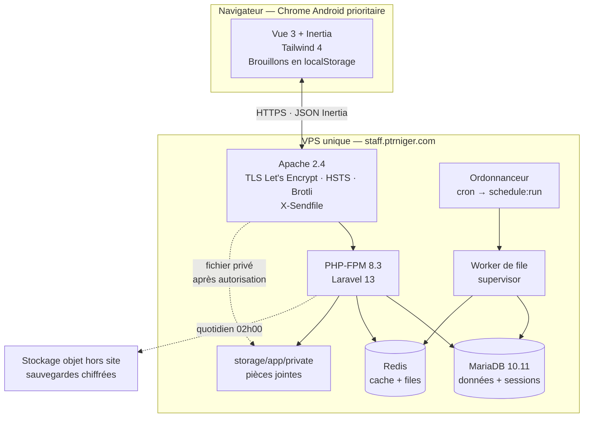

# 3. Vue d'ensemble

## 3.1 Style architectural

**Monolithe modulaire, déployé en un artefact unique.** Laravel rend des pages Vue via Inertia ;
il n'existe ni API publique, ni frontend déployé séparément, ni service auxiliaire hors du serveur
de files d'attente qui est le même processus PHP.

## 3.2 Ce que l'architecture ne fait pas

Écarté délibérément, pour que ces absences ne soient pas relues plus tard comme des oublis :

- **Pas de microservices.** Quatre domaines faiblement couplés dans un monolithe, § 8.2 du PRD.
- **Pas de SSR Inertia.** Doublerait l'exploitation (processus Node à superviser) pour un gain nul :
  les 68 écrans sont derrière authentification, aucun besoin de référencement.
- **Pas de PWA, pas de service worker, pas de mode hors ligne.** Phase 2 (§ 3.2 du PRD). Le brouillon
  local du § 18 couvre le besoin réel du MVP sans en payer la complexité.
- **Pas de bibliothèque de composants Vue.** Décision UX § 6.1, imposée par NFR2 et NFR3.
- **Pas de conteneurisation en production.** Un VPS, un déploiement scripté. Docker sert uniquement
  à l'intégration continue.
- **Pas de multi-tenant, aucune colonne `tenant_id`.** NFR28. Question Q15 en suspens : si la
  direction revient sur ce point à deux ans, la reprise sera coûteuse et assumée comme telle.

---
