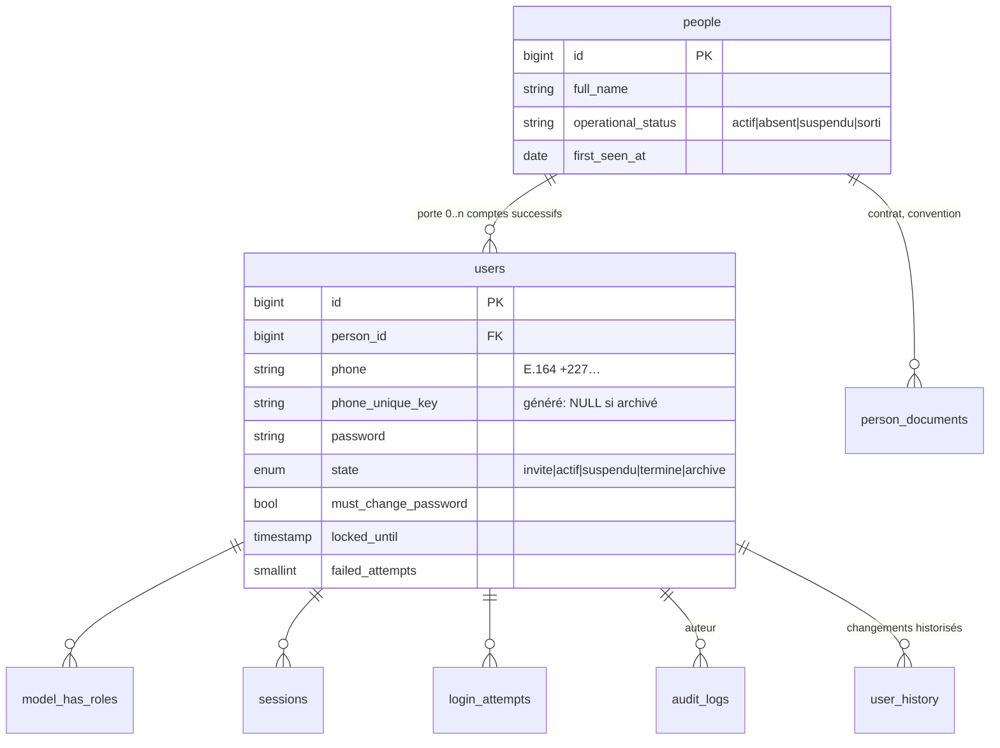
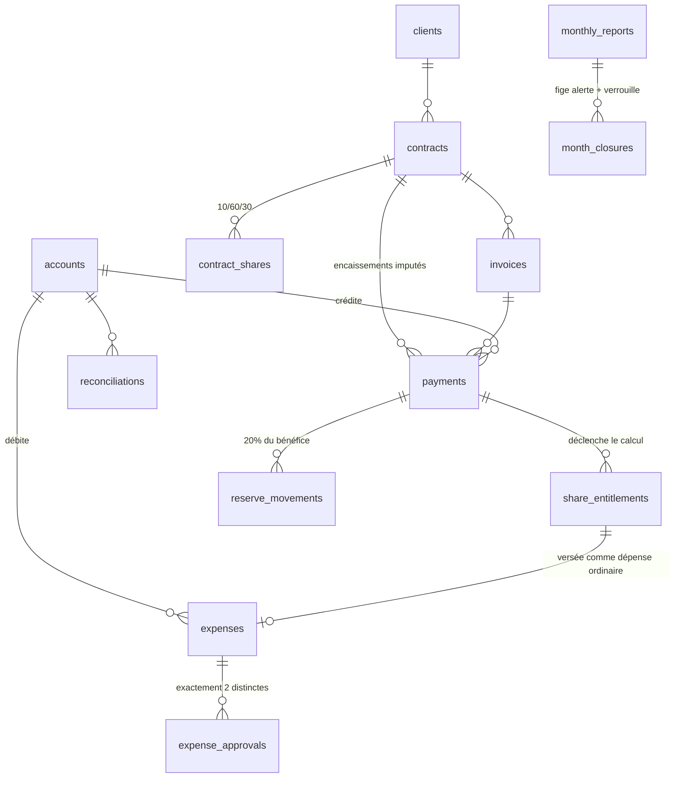

# 6. Modèle de données

## 6.1 Règles transverses

| Règle | Application |
|---|---|
| Montants | `BIGINT UNSIGNED`, entiers XOF, cast `integer`. Aucun `DECIMAL`, aucun flottant (NFR22) |
| Horodatages | `TIMESTAMP` UTC (DEC-01) |
| Dates métier | `DATE`, calendrier civil `Africa/Niamey` — jamais converties |
| Clés | `BIGINT UNSIGNED` auto-incrémenté ; `UUID` public pour les objets exposés en URL sensible |
| Suppression | **Aucune table métier ne porte de `deleted_at`.** Voir § 15 |
| États | Colonnes `ENUM` adossées à des enums PHP typés |
| Audit | Toute table de FR21 est couverte par l'observateur d'audit |

## 6.2 Noyau identité — A-06 / CONTRA-02

La séparation **personne / compte applicatif** est structurelle dès l'Étape 1, même sans les
abonnements de phase 2 qui la motivaient (CONTRA-02). Elle sert immédiatement FR4 : le retour d'une
personne dans l'entreprise crée un nouveau compte rattaché à la fiche personne existante.



**FR3 — unicité du téléphone sur les comptes non archivés.** Résolue au niveau base, pas
applicatif, par colonne générée et index unique. MySQL et MariaDB n'indexent pas les valeurs
`NULL` en doublon, ce qui produit exactement la sémantique demandée :

```sql
ALTER TABLE users
  ADD COLUMN phone_unique_key VARCHAR(20)
    GENERATED ALWAYS AS (IF(state = 'archive', NULL, phone)) STORED,
  ADD UNIQUE INDEX users_phone_active_unique (phone_unique_key);
```

Un compte archivé libère donc son numéro (FR3), et l'historique reste porté par `people`.
Sous réserve de Q17 / CONTRA-09 : si la direction impose l'unicité permanente, l'index devient un
`UNIQUE` simple sur `phone` — changement d'une ligne de migration.

**Historisation (FR18).** Table `user_history` : `user_id`, `field`, `old_value`, `new_value`,
`changed_by`, `changed_at`, `reason`. Alimentée par le même service que l'audit, dans la même
transaction. Elle sert la consultation métier ; `audit_logs` sert le contrôle. Les deux coexistent
volontairement : `audit_logs` est fermé à tous sauf `direction` (FR23), alors que l'historique d'une
fiche doit rester lisible par le responsable.

## 6.3 Noyau financier



Points de conception notables :

- **`payments` et `expenses` ne sont jamais modifiés après validation.** Correction = nouvelle
  version liée ; annulation = contre-écriture liée. Voir § 15.
- **`share_entitlements`** matérialise le droit à une part (FR131) ; le **versement** est une
  `expense` ordinaire à deux signatures (FR134). Les deux sont liés, jamais confondus : un droit
  calculé n'est pas un paiement effectué.
- **`reserve_movements`** est un livre auxiliaire. Le montant de la réserve n'est jamais une colonne
  de solde : il est la somme du livre (§ 16).
- **`month_closures`** porte le verrou de clôture (FR158) et la trace de réouverture (FR159).
- **`accounts.opening_balance`** est la seule saisie directe de solde ; le solde courant est
  toujours calculé (FR100).

## 6.4 Journal d'audit

```sql
CREATE TABLE audit_logs (
  id            BIGINT UNSIGNED AUTO_INCREMENT PRIMARY KEY,
  actor_id      BIGINT UNSIGNED NULL,          -- NULL = système (amorçage, tâche planifiée)
  actor_label   VARCHAR(120) NOT NULL,          -- dénormalisé : survit à l'archivage du compte
  occurred_at   DATETIME(3) NOT NULL,          -- surtout pas TIMESTAMP : voir note ci-dessous
  auditable_type VARCHAR(120) NOT NULL,
  auditable_id  BIGINT UNSIGNED NULL,
  action        VARCHAR(60) NOT NULL,           -- created|updated|approved|cancelled|exported…
  old_values    JSON NULL,
  new_values    JSON NULL,
  reason        TEXT NULL,                      -- motif, obligatoire sur annulation/correction
  ip_address    VARBINARY(16) NULL,
  user_agent    VARCHAR(255) NULL,
  INDEX (auditable_type, auditable_id),
  INDEX (actor_id, occurred_at),
  INDEX (occurred_at)
) ENGINE=InnoDB;
```

`actor_label` est dénormalisé volontairement : un journal d'audit dont les lignes deviennent
illisibles parce que le compte auteur a été archivé ne remplit pas sa fonction.

> **`occurred_at` est en `DATETIME(3)`, jamais `TIMESTAMP`.** Deux raisons, chacune suffisante sur une
> table en rétention **permanente** (§ 22.1) :
>
> 1. **`TIMESTAMP` s'arrête au 19 janvier 2038.** Une table qu'on ne purge jamais ne peut pas reposer
>    sur un type qui cesse de représenter le temps dans douze ans.
> 2. **`TIMESTAMP` est converti selon le fuseau de session MySQL** à chaque lecture et écriture. Une
>    restauration sur un serveur dont le `time_zone` diffère décalerait **tous** les horodatages du
>    journal — sur la table dont le rôle est précisément d'être opposable, et en contradiction directe
>    avec NFR23 (« dates stockées de façon non ambiguë »).
>
> `DATETIME` n'a ni plafond utile ni conversion de fuseau. La valeur reste ce qu'on a écrit.
> Corrigé le 19/07/2026, avant la première mise en production — après, il aurait fallu un
> `ALTER TABLE` sur une table protégée par déclencheurs et privilèges. Le test de schéma de la
> story 1.4 épingle `datetime(3)` pour empêcher toute régression.

---
