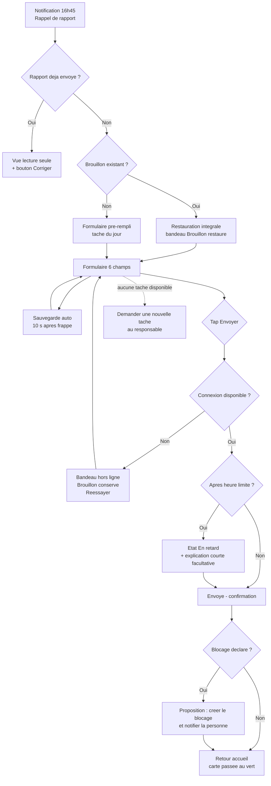
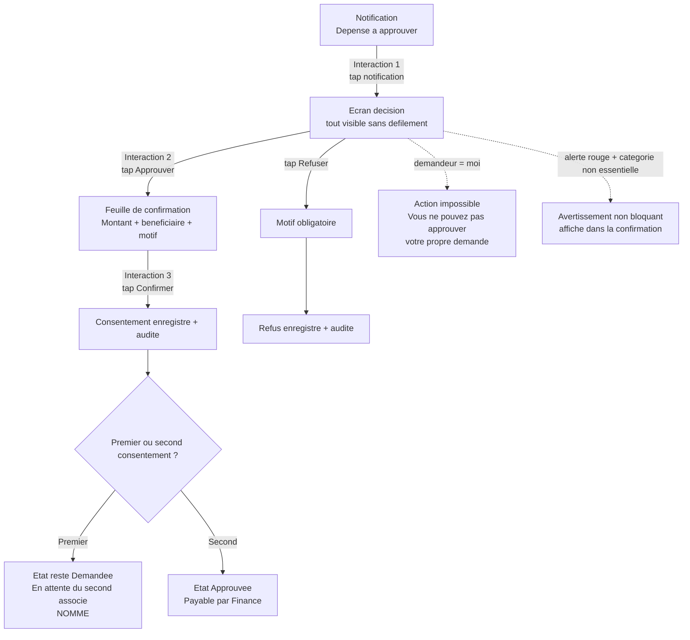
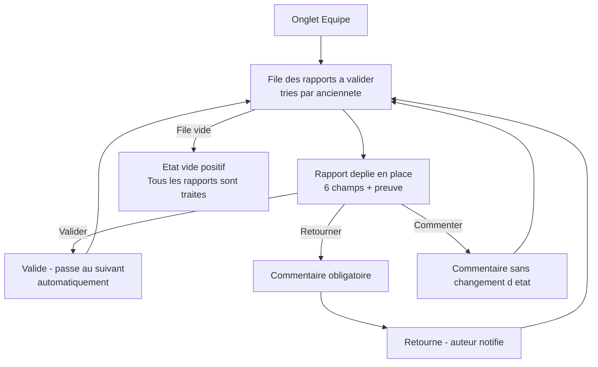
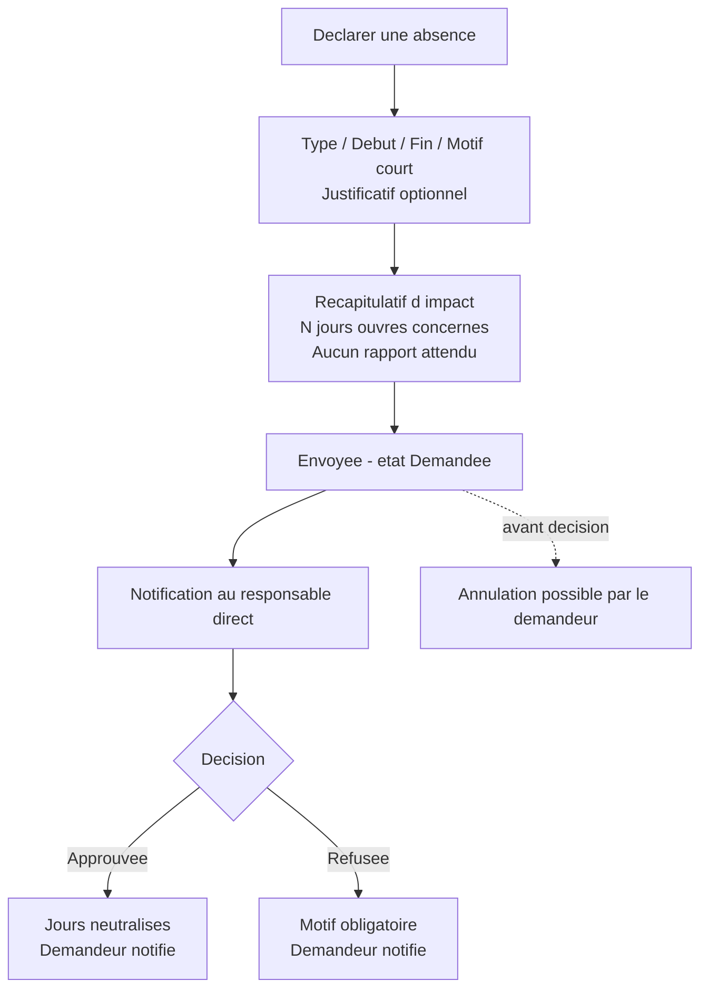
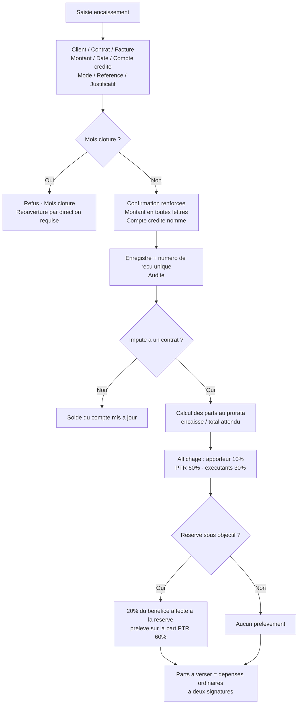
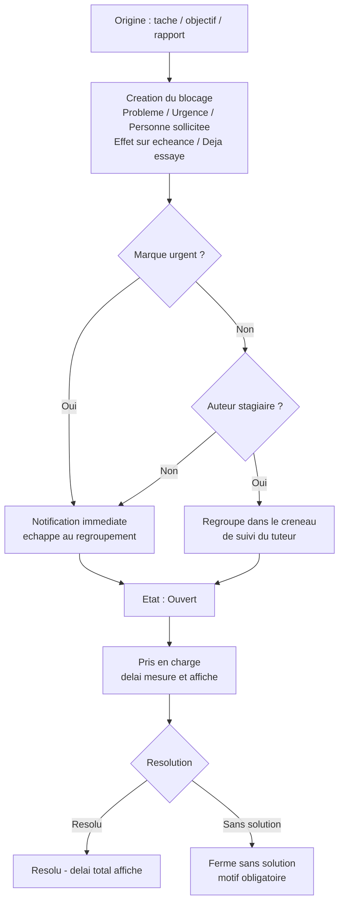
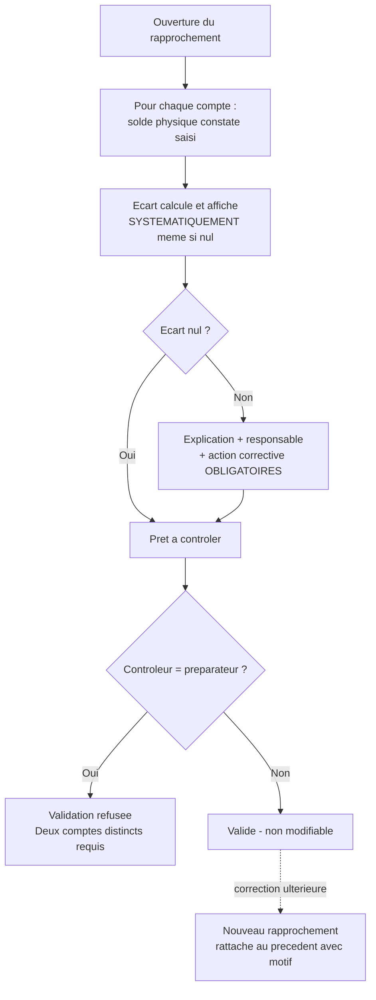

# PTR Staff — Spécification d'expérience utilisateur (UI/UX)

Ce document définit les objectifs d'expérience, l'architecture de l'information, les parcours
utilisateur et les spécifications d'interface de PTR Staff. Il sert de fondation au design visuel
et au développement frontend.

**Entrée :** `docs/prd.md` (validé le 18/07/2026).
**Ne contient pas de code frontend.** Les choix techniques d'implémentation (A-01 : Inertia.js
contre composants Vue dans Blade) relèvent de l'agent Architect ; ce document en fixe les
contraintes produit.

---

## 1. Objectifs et principes UX

### 1.1 Personas

Cinq personas issus des rôles applicatifs du § 4.1 du PRD. Ils ne sont pas des archétypes
génériques : l'effectif réel au lancement est de 5 à 12 personnes, connues nommément.

**Amina — exécutante (rôle `employe`)**
Graphiste ou développeuse. Travaille surtout sur téléphone Android d'entrée de gamme, en 3G, parfois
en déplacement chez un client. Ouvre l'application **deux fois par jour** : le matin pour voir ses
tâches, le soir vers 17 h 30 pour envoyer son rapport. Son besoin réel n'est pas d'être suivie :
c'est d'**être reconnue et de ne jamais être accusée sans trace**. Point de rupture : un formulaire
qui lui prend plus de trois minutes le soir, ou qui perd sa saisie quand le réseau tombe. Elle
abandonnera silencieusement, et l'entreprise perdra sa donnée la plus précieuse.

**Ibrahim — associé (rôle `direction`)**
Propriétaire. Deux comptes `direction` existent, ni plus ni moins. Consulte l'application entre deux
rendez-vous, souvent debout, souvent en une seule main. Sa charge dominante n'est pas la lecture de
tableaux de bord : c'est de **débloquer les décisions qui l'attendent** — approbations de dépense en
premier. Est soumis aux mêmes objectifs et au même rapport quotidien que tout le monde (RM-03, P5) ;
son interface ne doit jamais le laisser croire le contraire. Point de rupture : devoir chercher ce
qu'on attend de lui.

**Fatima — responsable financière (rôle `finance`)**
Seule à saisir encaissements, dépenses et rapprochements. C'est le seul persona qui travaille
**volontiers sur grand écran**, en session longue, sur des écrans denses. Elle n'approuve jamais une
dépense : elle prépare et elle paie. Son besoin : saisir vite sans erreur, et retrouver la trace de
tout. Point de rupture : une opération financière ambiguë, ou un écran qui la laisse douter de ce
qu'elle vient d'enregistrer.

**Moussa — tuteur (rôle `tuteur`)**
Responsable d'équipe, encadre jusqu'à 3 stagiaires actifs. Sa charge dominante est la **validation
des rapports de son équipe**, en fin de journée ou le lendemain matin, sur téléphone. Il a besoin de
traiter une file, pas d'ouvrir dix écrans. Point de rupture : devoir naviguer vers chaque rapport
individuellement.

**Salifou — stagiaire (rôle `stagiaire`)**
Jeune, à l'aise sur téléphone, peu familier du vocabulaire d'entreprise. C'est le persona le plus
exposé au risque d'humiliation : son interface doit valoriser l'apprentissage, jamais exposer son
retard à d'autres que son tuteur. N'accède à **aucune donnée financière**, en aucune circonstance
(NFR19).

### 1.2 Objectifs d'utilisabilité

| # | Objectif | Mesure de recette |
|---|---|---|
| U1 | **Le rapport quotidien se saisit en moins de 3 minutes** sur téléphone, du premier champ à la confirmation | Chronométrage sur téléphone réel en 3G dégradée (NFR4) — condition de recette de l'Étape 3 |
| U2 | **Une dépense s'approuve ou se refuse en 3 interactions** depuis la notification | Comptage des taps, hors saisie du motif de refus (FR121) |
| U3 | **Aucune saisie n'est jamais perdue** | Coupure réseau simulée en cours de saisie ; restauration intégrale à la réouverture (NFR5, FR63) |
| U4 | **Premier rendu utile en moins de 3 secondes** en 3G dégradée (400 kbit/s, 400 ms de latence) | Mesure sur les 4 pages du parcours quotidien (NFR1) |
| U5 | **Prise en main sans formation** | Un nouvel arrivant envoie son premier rapport sans assistance, le premier jour |
| U6 | **Aucun utilisateur ne se sent surveillé ou comparé** | Revue de vocabulaire ; absence de tout classement (FR82) |

### 1.3 Principes de conception

Les six principes du § 2.4 du PRD sont repris ici en leur traduction d'interface. Ils sont
**opposables en revue de design** : un écran qui en viole un est un écran à refaire.

1. **Un objectif par écran.** Sur téléphone, des blocs empilés, le plus urgent en haut. Jamais de
   tableau de bord dense. Si un écran répond à deux questions, il en faut deux.
2. **L'action attendue en tête.** Le tableau de bord s'ouvre sur ce que l'utilisateur doit faire
   maintenant, pas sur ce qu'il pourrait consulter. Ibrahim voit « En attente de mon approbation » ;
   Amina voit « Mon rapport du jour ».
3. **La preuve est un champ de premier plan.** Jamais repliée en bas de formulaire, jamais optionnelle
   dans la hiérarchie visuelle. Un objectif « atteint » sans preuve est refusé par le serveur (P1,
   FR47) — l'interface doit le rendre évident *avant* la tentative, pas après.
4. **Le vocabulaire est celui de la contribution, jamais de la surveillance.** « Ce que j'ai
   produit », pas « justifier son temps ». « En attente de validation », pas « non conforme ».
   Aucun terme de sanction nulle part.
5. **Rien ne se supprime, et l'interface le dit.** Le bouton est « Annuler avec motif » ou
   « Corriger », jamais « Supprimer ». L'utilisateur doit comprendre que la trace demeure (P2).
6. **Sobriété.** Chaque kilo-octet se paie en 3G. Aucun élément décoratif, aucune police externe,
   aucune image non fonctionnelle. Un écran qui exige le desktop est un écran mal conçu (P6).

### 1.4 Interdits absolus

Ces règles ne sont pas des préférences esthétiques. Elles sont issues de décisions produit et ne se
négocient pas en design review.

- **Aucun classement comparatif entre personnes**, nulle part, sous aucune forme — ni podium, ni
  pourcentage relatif, ni tri par performance, ni « meilleur contributeur du mois » (FR82, § 3.3).
- **Aucune présentation humiliante.** Un retard s'affiche à la personne concernée et à son
  responsable direct, jamais à ses pairs. Une liste d'équipe ne trie jamais par nombre de retards.
- **Aucune information portée par la couleur seule** (NFR31, FR45). Voir § 6.2.
- **Aucun message technique à l'utilisateur final** (NFR17, NFR32). Voir § 5.6.
- **Aucun menu ne fait office de contrôle d'accès.** Masquer une entrée de menu est un confort, pas
  une sécurité : l'autorisation est vérifiée côté serveur sur chaque requête (P4, PERM-01).

### 1.5 Journal des versions

| Date | Version | Description | Auteur |
|---|---|---|---|
| 18/07/2026 | v1.0 | Spécification initiale, dérivée du PRD validé du 18/07/2026 | Sally (UX Expert) |

---

## 2. Architecture de l'information

### 2.1 Principe structurant

L'application n'est pas organisée par **objet métier** (rapports, objectifs, dépenses…) mais par
**intention utilisateur**. C'est la conséquence directe du principe 2 : un exécutant ne cherche pas
« le module rapport », il veut « envoyer mon rapport ».

Quatre zones seulement, plus le compte :

| Zone | Question à laquelle elle répond | Rôles concernés |
|---|---|---|
| **Accueil** | Que dois-je faire maintenant ? | Tous |
| **Mon travail** | Qu'est-ce que je produis et où en suis-je ? | Tous |
| **Mon équipe** | Qui a besoin de moi et qu'est-ce que je dois valider ? | `tuteur`, `direction` |
| **Argent** | Où en est la trésorerie et qu'est-ce qui attend une décision ? | `finance`, `direction` |
| **Administration** | Comptes, paramètres, traces | `direction`, `super_admin` |

Une même donnée apparaît dans plusieurs zones sous des angles différents. C'est voulu : le rapport
quotidien est une **action** dans « Mon travail » et une **file à traiter** dans « Mon équipe ».

### 2.2 Inventaire des écrans

L'ordre de conception suit les quatre étapes de livraison. Le rapport quotidien (Étape 3) est
toutefois le **point de vérité du produit** et est spécifié en premier au § 4.1.

#### Étape 1 — Socle

| # | Écran | Rôles | Note |
|---|---|---|---|
| E1.1 | Connexion (téléphone `+227` + mot de passe) | Tous | Aucun lien d'inscription (FR1) |
| E1.2 | Changement de mot de passe obligatoire | Tous | Bloque tout autre accès (FR5) |
| E1.3 | Compte bloqué / suspendu | Tous | Message non technique (FR10) |
| E1.4 | Accueil — squelette | Tous | Enrichi aux étapes 2 et 4 |
| E1.5 | **En attente de mon approbation** | `direction` | En tête d'accueil (FR120, FR167) |
| E1.6 | Demande de dépense — création | Tous | Formulaire court (FR115) |
| E1.7 | Demande de dépense — détail et décision | `direction` | 3 interactions (FR121) |
| E1.8 | Liste des demandes de dépense | Tous (filtrée) | Chacun voit les siennes |
| E1.9 | Centre de notifications | Tous | Compteur global (FR30) |
| E1.10 | Déclaration d'absence | Tous | (FR36) |
| E1.11 | Approbation d'absence | Responsable direct | (FR37) |
| E1.12 | Liste des comptes | `direction`, `super_admin` | (FR1) |
| E1.13 | Fiche compte — création et édition | `direction`, `super_admin` | Personne ≠ compte (FR4) |
| E1.14 | Rôles et permissions | `direction`, `super_admin` | (FR11) |
| E1.15 | Fiche personne — dossier et documents | Concerné, responsable, `direction` | (FR17) |
| E1.16 | Journal d'audit | `direction` **exclusivement** | Jamais `finance` (D-04, FR23) |
| E1.17 | Paramètres généraux | `direction`, `super_admin` | (FR25) |
| E1.18 | Calendrier des jours travaillés et fériés | `direction` | (FR35) |
| E1.19 | Historique de connexion et sessions | `direction` | (FR9) |
| E1.20 | Mon profil | Tous | Lecture + mot de passe |

#### Étape 2 — Objectifs et projets

| # | Écran | Rôles |
|---|---|---|
| E2.1 | Accueil personnel complet | Tous |
| E2.2 | Priorités d'entreprise du mois (max 5) | `direction` gère, tous lisent |
| E2.3 | Mes objectifs du mois — liste | Tous |
| E2.4 | Objectif — détail, progrès, preuve | Tous |
| E2.5 | Objectif — création / proposition | Tous |
| E2.6 | Objectifs — validation et retour | `tuteur`, `direction` |
| E2.7 | Objectifs — vue calendrier | Tous |
| E2.8 | Synthèse mensuelle des objectifs | Selon permissions |
| E2.9 | Projets — liste | Selon permissions |
| E2.10 | Projet — détail, membres, livrables | Selon permissions |
| E2.11 | Tâche — détail et sous-tâches | Selon permissions |
| E2.12 | Mes tâches du jour | Tous |

#### Étape 3 — Redevabilité et encadrement

| # | Écran | Rôles |
|---|---|---|
| **E3.1** | **Rapport quotidien — saisie** | **Tous — écran de référence** |
| E3.2 | Rapport quotidien — confirmation d'envoi | Tous |
| E3.3 | Mon historique de rapports | Tous |
| E3.4 | Rapport — détail et versions | Auteur, responsable |
| E3.5 | Rapports de l'équipe — file de validation | `tuteur`, `direction` |
| E3.6 | Blocage — création | Tous |
| E3.7 | Blocage — suivi et prise en charge | Tous |
| E3.8 | Revue hebdomadaire — conduite | `tuteur`, `direction` |
| E3.9 | Revue hebdomadaire — ma revue | Tous |
| E3.10 | Plan d'amélioration | `tuteur`, `direction`, concerné |
| E3.11 | Fiche d'entrée de stagiaire | `tuteur`, `direction` |
| E3.12 | Dossier de stagiaire et plan de stage | `tuteur`, `direction`, concerné |
| E3.13 | Checklists d'intégration et de sortie | `tuteur`, `direction` |
| E3.14 | Créneaux de suivi (demandes groupées) | `tuteur` |
| E3.15 | Bibliothèque de documents internes | Tous |
| E3.16 | Document — lecture et accusé d'acceptation | Tous |

#### Étape 4 — Argent et pilotage

| # | Écran | Rôles |
|---|---|---|
| E4.1 | Tableau de bord financier | `finance`, `direction` |
| E4.2 | Tableau de bord direction consolidé | `direction` |
| E4.3 | Comptes financiers — liste et soldes | `finance`, `direction` |
| E4.4 | Encaissement — saisie | `finance` |
| E4.5 | Encaissement — détail, correction, annulation | `finance`, `direction` |
| E4.6 | Clients — liste et fiche | `finance`, `direction` |
| E4.7 | Factures et créances | `finance`, `direction` |
| E4.8 | Contrat — répartition et parts | `finance`, `direction` |
| E4.9 | **Ma part** (vue restreinte) | Bénéficiaire non-associé (FR136) |
| E4.10 | Dépense — paiement et justificatif | `finance` |
| E4.11 | Dépenses payées sans justificatif | `finance`, `direction` |
| E4.12 | Demande de remboursement | Tous |
| E4.13 | Budgets et charges fixes | `direction`, `finance` |
| E4.14 | Réserve et niveau d'alerte | `direction` |
| E4.15 | Utilisation de la réserve | `direction` |
| E4.16 | Rapprochement hebdomadaire | `finance`, `direction` |
| E4.17 | Rapport financier mensuel | `finance` prépare, `direction` valide |
| E4.18 | Clôture et réouverture de mois | `direction` |
| E4.19 | Recherche globale | Tous (filtrée) |
| E4.20 | Export CSV | Selon permissions |

**Total : 68 écrans** sur les quatre étapes.

### 2.3 Plan de site

```mermaid
graph TD
    LOGIN[Connexion] --> PWD[Changement de mot de passe obligatoire]
    PWD --> HOME[Accueil - varie selon role]

    HOME --> W[Mon travail]
    HOME --> T[Mon equipe]
    HOME --> F[Argent]
    HOME --> A[Administration]
    HOME --> N[Notifications]
    HOME --> P[Mon profil]

    W --> W1[Rapport du jour]
    W --> W2[Mes objectifs]
    W --> W3[Mes taches]
    W --> W4[Mes blocages]
    W --> W5[Mes absences]
    W --> W6[Mes demandes de depense]
    W --> W7[Ma revue hebdomadaire]
    W --> W8[Ma part sur contrat]
    W --> W9[Documents internes]

    W1 --> W1a[Historique et versions]
    W2 --> W2a[Objectif - detail et preuve]
    W3 --> W3a[Tache - detail]

    T --> T1[Rapports a valider]
    T --> T2[Objectifs a valider]
    T --> T3[Absences a approuver]
    T --> T4[Blocages de l equipe]
    T --> T5[Revues hebdomadaires]
    T --> T6[Mes stagiaires]
    T --> T7[Creneaux de suivi]

    T6 --> T6a[Fiche d entree]
    T6 --> T6b[Plan de stage]
    T6 --> T6c[Checklists]

    F --> F1[Tableau de bord financier]
    F --> F2[Comptes et soldes]
    F --> F3[Encaissements]
    F --> F4[Depenses et paiements]
    F --> F5[Clients factures creances]
    F --> F6[Contrats et parts]
    F --> F7[Budgets et charges fixes]
    F --> F8[Reserve et alerte]
    F --> F9[Rapprochement hebdomadaire]
    F --> F10[Rapport mensuel et cloture]

    A --> A1[Comptes et roles]
    A --> A2[Parametres generaux]
    A --> A3[Calendrier et jours feries]
    A --> A4[Journal d audit - direction seule]
    A --> A5[Connexions et sessions]

    HOME -.bloc prioritaire direction.-> APPRO[En attente de mon approbation]
    APPRO --> DEC[Depense - decision]
```



### 2.4 Fil d'Ariane

Sur téléphone, **pas de fil d'Ariane** : il consomme une ligne précieuse pour une information que la
pile de navigation donne déjà. Un unique bouton **« ‹ Retour »** contextuel en tête d'écran, libellé
avec la destination réelle (« ‹ Mes objectifs ») plutôt qu'un « Retour » nu.

À partir de 1024 px, un fil d'Ariane à un seul niveau de profondeur apparaît sur les écrans de
consolidation financière, où l'utilisateur navigue latéralement entre objets liés
(contrat → encaissement → dépense de versement).

---

## 3. Navigation par rôle

### 3.1 Modèle de navigation

**Téléphone (< 768 px) :** barre d'onglets fixe en bas, **5 entrées maximum**, la cinquième étant
toujours « Plus ». Le pouce atteint le bas de l'écran ; le haut est réservé au titre et au retour.

**Tablette et desktop (≥ 768 px) :** rail latéral gauche persistant, entrées libellées, groupées par
zone. La barre du bas disparaît.

**Règle d'or :** la première entrée de la barre est toujours **Accueil**, et l'accueil ouvre toujours
sur l'action attendue du rôle. La deuxième entrée est l'action la plus fréquente du rôle.

### 3.2 Barres de navigation par rôle

Un utilisateur cumulant plusieurs rôles (fréquent : `direction` + `finance`) reçoit la barre du rôle
**le plus large**, augmentée des entrées de ses autres rôles dans « Plus ».

| Rôle | 1 | 2 | 3 | 4 | 5 |
|---|---|---|---|---|---|
| `employe` | Accueil | **Rapport** | Objectifs | Tâches | Plus |
| `stagiaire` | Accueil | **Rapport** | Mon stage | Tâches | Plus |
| `tuteur` | Accueil | **Équipe** | Rapport | Objectifs | Plus |
| `direction` | Accueil | **À approuver** | Équipe | Argent | Plus |
| `finance` | Accueil | **Argent** | Dépenses | Contrats | Plus |
| `super_admin` | Accueil | Comptes | Paramètres | Journaux | Plus |

### 3.3 Contenu de « Plus » par rôle

| Rôle | Entrées dans « Plus » |
|---|---|
| `employe` | Mes blocages · Mes absences · Mes demandes de dépense · Ma revue · **Ma part** (si bénéficiaire) · Documents internes · Mon profil · Déconnexion |
| `stagiaire` | Mes blocages · Mes absences · Mes demandes · Ma revue · Documents internes · Mon profil · Déconnexion |
| `tuteur` | Mes stagiaires · Créneaux de suivi · Revues hebdomadaires · Mes blocages · Mes absences · Mes demandes · Documents · Profil · Déconnexion |
| `direction` | **Mon rapport du jour** · Mes objectifs · Comptes et rôles · Paramètres · Calendrier · **Journal d'audit** · Connexions · Réserve · Rapport mensuel · Recherche · Documents · Profil · Déconnexion |
| `finance` | Rapprochement · Rapport mensuel · Budgets et charges · Clients et factures · **Mon rapport du jour** · Mes objectifs · Recherche · Documents · Profil · Déconnexion |
| `super_admin` | Connexions et sessions · Santé de l'application · Profil · Déconnexion |

**Point d'attention — symétrie hiérarchique (P5, RM-03).** `direction` et `finance` sont soumis au
même rapport quotidien et aux mêmes objectifs que tout le monde. Ces entrées figurent dans leur
« Plus », **et leur carte « Mon rapport du jour » apparaît sur leur accueil au même titre que pour un
exécutant** — placée sous le bloc d'approbation, mais jamais absente. Une interface qui exempte
visuellement la direction du rapport quotidien est un défaut à corriger.

### 3.4 Ce que la navigation ne fait pas

Le menu **masque** ce que le rôle ne peut pas atteindre, pour la sobriété et la clarté. Il ne
**protège** rien. Toute ressource est vérifiée côté serveur à chaque requête (PERM-01), et une URL
directe vers une ressource non autorisée retourne un refus franc, jamais un contenu partiel ni une
redirection silencieuse (PERM-02). Voir § 5.6 pour l'écran de refus.

---

## 4. Parcours critiques

Sept parcours. Le premier est le point de vérité du produit et est traité en priorité, conformément
au § 15.1 du PRD.

### 4.1 Parcours 1 — Envoyer mon rapport quotidien ★

> **C'est l'écran qui décide du succès ou de l'échec de PTR Staff.** Amina, 17 h 35, téléphone
> d'entrée de gamme, 3G qui vacille, fin de journée, fatiguée. Si cet écran lui coûte plus de trois
> minutes ou perd sa saisie une seule fois, elle cessera de l'utiliser — et toute la redevabilité de
> l'entreprise s'effondre avec.

**Objectif utilisateur :** rendre compte de sa journée et en apporter la preuve, sans y passer plus
de trois minutes.

**Points d'entrée :** notification de rappel (60 min avant l'heure limite, FR29) · carte « Mon
rapport du jour » en tête d'accueil · onglet **Rapport** de la barre du bas.

**Critère de succès :** rapport à l'état `envoye`, confirmation visible, en moins de 3 minutes
(NFR4).

#### Budget des 3 minutes

Le budget est la contrainte de conception dominante. Chaque champ a un coût cible ; tout dépassement
se paie sur un autre champ ou sur le taux d'abandon.

| Étape | Champ | Coût cible | Levier de conception |
|---|---|---|---|
| Ouverture | — | 5 s | Lien direct depuis la notification, aucune page intermédiaire |
| 1 | Tâche prévue | 15 s | **Pré-remplie** depuis les tâches du jour (FR62), modifiable |
| 2 | Résultat obtenu | 45 s | Champ libre, le seul vraiment coûteux — on lui laisse la place |
| 3 | Preuve ou lien | 30 s | Appareil photo en un tap, ou collage de lien |
| 4 | Blocage | 5 s | **Interrupteur à « Non » par défaut** ; ne se déplie que si « Oui » |
| 5 | Prochaine action | 30 s | Champ libre court |
| 6 | Aide demandée | 5 s | **Interrupteur à « Non » par défaut** ; ne se déplie que si « Oui » |
| Envoi | Relecture + envoi | 15 s | Bouton unique, pas de récapitulatif intermédiaire |
| | **Total** | **2 min 30 s** | **30 s de marge** sur l'exigence NFR4 |

**Le levier décisif** est le traitement des champs 4 et 6. Les six champs sont **obligatoires**
(FR61), mais deux d'entre eux ont une réponse négative dans la grande majorité des journées. Les
présenter comme des zones de texte vides coûterait 90 secondes et briserait le budget. Présentés
comme des interrupteurs à « Non » par défaut, qui ne dévoilent un champ de saisie que sur « Oui »,
ils coûtent 10 secondes au total. L'obligation est satisfaite — une réponse explicite est
enregistrée dans les deux cas — sans coût de saisie.

#### Diagramme de parcours



#### Cas limites et gestion d'erreur

- **Perte de connexion pendant la saisie.** Le brouillon est déjà en sécurité (sauvegarde locale
  ≤ 10 s après la dernière frappe, NFR5). Un bandeau discret non bloquant apparaît en haut :
  « Hors connexion. Votre saisie est conservée. » La saisie **continue normalement** — on ne bloque
  jamais un champ pour cause de réseau.
- **Perte de connexion au moment de l'envoi.** L'envoi échoue proprement : aucun enregistrement
  partiel (NFR6). Message : « L'envoi n'a pas abouti. Votre rapport est conservé sur cet appareil.
  Réessayez quand la connexion revient. » Bouton **Réessayer**. L'état reste `brouillon`.
- **Fermeture de l'onglet en cours de saisie.** Restauration intégrale à la réouverture **sur le
  même appareil** (FR63), avec bandeau « Brouillon restauré » et l'heure de la dernière sauvegarde.
  La restauration inter-appareils n'est pas promise en MVP et l'interface ne la suggère pas.
- **Envoi après l'heure limite (17 h 45).** Le rapport passe à `en_retard` (FR65). L'interface
  affiche le retard constaté et sollicite une explication courte, **facultative** (FR71). Ton neutre,
  jamais accusateur : « Envoyé 40 minutes après l'heure limite. Souhaitez-vous préciser
  pourquoi ? (facultatif) ». Jamais « Vous êtes en retard ».
- **Jour non travaillé ou absence approuvée.** Aucun rapport n'est attendu (FR38). La carte
  d'accueil affiche « Jour non travaillé — aucun rapport attendu » et le formulaire n'est pas
  proposé. L'indicateur de ponctualité exclut ce jour (FR39).
- **Aucune tâche assignée.** Le champ 1 n'est pas pré-rempli. Un lien inline propose « Je n'ai pas de
  tâche — demander une tâche à mon responsable » (FR69), qui crée la demande sans quitter le
  formulaire.
- **Rapport déjà envoyé le même jour.** Il existe au plus un rapport par personne et par jour
  travaillé (FR60). L'écran s'ouvre en lecture seule avec un bouton **Corriger** ; toute correction
  crée une nouvelle version et conserve la précédente, consultable (FR68).
- **Retour du responsable (état `retourne`).** Le commentaire du responsable est affiché **en tête du
  formulaire**, au-dessus du premier champ, pour que la correction demandée soit lue avant la
  ressaisie. Le responsable ne peut modifier aucun champ (FR67) : l'interface ne lui offre aucun
  champ éditable, seulement commenter, valider ou retourner.
- **Pièce jointe trop lourde ou de type refusé.** Contrôle côté client pour le confort, mais le refus
  fait autorité côté serveur (NFR16). Message : « Ce fichier fait 8 Mo, la limite est de 5 Mo.
  Choisissez un fichier plus léger ou prenez une photo de moins bonne qualité. » — ce qui s'est
  passé, et l'action attendue (NFR32).

#### Notes

Le pré-remplissage (FR62) est le second levier du budget après les interrupteurs. Il doit être
**visiblement modifiable** — un champ pré-rempli qui a l'air verrouillé produit des rapports faux,
ce qui est pire que pas de rapport du tout. Le champ pré-rempli porte donc l'aspect d'un champ
ordinaire, avec la mention discrète « pré-rempli depuis vos tâches du jour » sous le libellé.

L'upload de la preuve démarre **en arrière-plan dès la sélection du fichier**, pendant que
l'utilisatrice saisit les champs 4 à 6. Au moment de l'envoi, le fichier est déjà transféré dans la
grande majorité des cas : c'est ce qui rend l'envoi quasi instantané en 3G et protège les 15 dernières
secondes du budget.

### 4.2 Parcours 2 — Approuver une dépense en 3 interactions ★

**Objectif utilisateur :** Ibrahim décide, depuis une notification, sans chercher.

**Points d'entrée :** notification « Dépense à approuver » · bloc « En attente de mon approbation »
en tête d'accueil (FR120) · rappels automatiques à J+1 et J+2 (FR33).

**Critère de succès :** décision enregistrée et auditée en **3 interactions**, hors saisie du motif
de refus (FR121).



#### Cas limites et gestion d'erreur

- **Le demandeur est l'approbateur** (FR119, RM-10). Les boutons de décision ne sont pas affichés.
  Message explicite : « Vous êtes le demandeur de cette dépense. Elle doit être approuvée par les
  deux autres comptes de direction. » Le serveur refuse également l'opération si elle est tentée par
  URL directe.
- **Second consentement manquant** (FR118). L'écran indique **nommément** qui doit encore décider :
  « Votre accord est enregistré. En attente de l'accord de {nom}. » Sans le nom, l'utilisateur ne
  sait pas qui relancer — c'est la différence entre un circuit qui avance et un circuit qui dort.
- **Approbation déjà donnée par l'autre associé.** Le bandeau le dit avant la décision : « {nom} a
  approuvé le 17/07 à 14 h 12. Votre accord rendra cette dépense payable. » L'utilisateur doit savoir
  que son geste est le geste final.
- **Niveau d'alerte rouge et catégorie non essentielle** (FR164). Avertissement **non bloquant**
  affiché dans la feuille de confirmation, jamais un blocage : « Trésorerie en alerte rouge. Cette
  dépense n'est pas marquée essentielle. » Le logiciel constate, l'humain décide (P3).
- **Versement de part de contrat** (FR134, RM-14). Les parts de 10 % et 30 % restent dues et payables
  en alerte rouge : **aucun avertissement rouge n'est affiché** sur ces dépenses. L'écran affiche à
  la place la méthode de calcul complète (§ 4.5).
- **Dépense déjà décidée entre-temps.** Si l'autre associé a refusé pendant la consultation, l'écran
  bascule en lecture seule au moment de la confirmation : « Cette demande a été refusée par {nom} le
  {date}. Aucune action n'est possible. » Jamais d'erreur technique de concurrence.
- **Refus.** Motif obligatoire (FR122). Le champ motif est présenté immédiatement, pas après une
  confirmation supplémentaire — le refus n'est pas puni d'interactions additionnelles.

#### Note de conception

Le pari de ce parcours est que **tout ce qui est nécessaire à la décision tient sur un seul écran de
téléphone sans défilement** : demandeur, montant, bénéficiaire, motif, catégorie, projet ou contrat
rattaché, résultat attendu, ancienneté de la demande, et l'état du second consentement. Si un
élément déborde, c'est un élément à retirer de l'écran de décision, pas un défilement à accepter.
Le justificatif prévisionnel, s'il existe, est une vignette dépliable — pas un contenu chargé
d'emblée (poids de page, NFR2).

### 4.3 Parcours 3 — Valider les rapports de mon équipe

**Objectif utilisateur :** Moussa traite en une session tous les rapports en attente, sans ouvrir
dix écrans.

**Points d'entrée :** notification · onglet **Équipe** · carte « Rapports à valider » sur l'accueil.

**Critère de succès :** la file est vidée ; chaque rapport a reçu validation, retour ou commentaire.



#### Cas limites et gestion d'erreur

- **Le responsable ne peut modifier aucun champ** (FR67). L'interface ne présente aucun champ
  éditable sur le contenu de l'auteur — seulement commenter, valider, retourner. C'est une garantie
  de confiance, et elle doit être visible : les champs sont typographiquement des textes, pas des
  entrées de formulaire.
- **Rapport manquant.** La file distingue « à valider » (rapports envoyés) et « non envoyés ». La
  seconde liste est factuelle, sans jugement : « Rapport non envoyé aujourd'hui », avec un bouton
  **Relancer** qui envoie une notification. Aucune mention de sanction (RM-18).
- **Membre absent ou jour non travaillé.** N'apparaît pas dans la liste des manquants (FR38).
  L'interface affiche « Absence approuvée du 15 au 19/07 » à sa ligne.
- **Aucun tri par performance.** La file se trie par ancienneté ou par nom, **jamais** par nombre de
  retards ni par taux de validation (FR82). Aucun compteur comparatif entre membres n'apparaît sur
  cet écran.
- **Rapport corrigé après validation.** Une nouvelle version revient dans la file avec le repère
  « Version 2 », et un accès en un tap à la comparaison avec la version précédente (FR68).

### 4.4 Parcours 4 — Déclarer et faire approuver une absence

**Objectif utilisateur :** Amina déclare une absence ; aucun rapport ne lui sera réclamé sur cette
période.

**Critère de succès :** absence à l'état `approuvee` ; les jours couverts sortent du dénominateur des
indicateurs de ponctualité (FR39).



#### Cas limites et gestion d'erreur

- **Chevauchement avec une absence existante.** Détecté à la saisie : « Vous avez déjà une absence
  déclarée du 12 au 14/07. Modifiez les dates ou annulez la précédente. »
- **Dates rétroactives.** Autorisées — une maladie se déclare rarement à l'avance. Un repère
  « Absence déclarée après coup » est visible pour le responsable, sans blocage.
- **Absence couvrant des jours non travaillés.** Le récapitulatif d'impact ne compte que les jours
  ouvrés réels : « Du 15 au 21/07 — 5 jours ouvrés concernés » (le week-end n'est pas décompté).
- **Responsable direct non défini.** L'absence est adressée à `direction` par défaut, et l'écran le
  dit : « Aucun responsable direct n'est défini pour votre compte. Cette demande sera adressée à la
  direction. »
- **Décision en attente à l'heure limite du rapport.** Tant que l'absence n'est pas `approuvee`, le
  rapport reste attendu. La carte d'accueil le signale : « Absence en attente d'approbation — le
  rapport reste attendu aujourd'hui. » Sans quoi l'utilisateur croit être couvert et se retrouve en
  retard.

### 4.5 Parcours 5 — Enregistrer un encaissement et déclencher les parts

**Objectif utilisateur :** Fatima enregistre un paiement reçu ; le système en déduit seul les parts
dues et l'affectation à la réserve.

**Critère de succès :** encaissement enregistré avec numéro de reçu unique ; parts calculées au
prorata et affichées ; méthode de calcul consultable.



#### Cas limites et gestion d'erreur

- **Mois clôturé** (FR114, FR158). Refus franc, jamais un enregistrement silencieux dans un autre
  mois : « Le mois de juin 2026 est clôturé. Aucune écriture ne peut y être imputée. La réouverture
  relève de la direction, avec motif. »
- **Correction ou annulation** (FR111). Aucune suppression n'est proposée nulle part. Deux actions
  seulement : **Corriger** (nouvelle version motivée) et **Annuler** (contre-écriture motivée). Le
  numéro de reçu n'est jamais réutilisé, même après annulation (FR110) — l'interface le rappelle.
- **Encaissement enregistré plus de 24 h après réception déclarée** (FR112). Repère visible, sans
  blocage ni ton accusateur : « Enregistré 3 jours après la date de réception déclarée. » Le fait est
  constaté, la décision reste humaine (P3).
- **Contrat sans apporteur** (FR128). L'écran affiche explicitement « Apporteur : aucun → 100 % PTR
  Niger », plutôt qu'un champ vide qui laisserait croire à un oubli de saisie.
- **Parts jamais dues sans encaissement** (FR132, RM-13). L'écran du contrat sépare visuellement et
  sans ambiguïté « facturé » et « encaissé ». Une facture émise et non payée n'affiche **aucune part
  due**, avec la mention « Aucune part due — encaissement non enregistré ».
- **Méthode de calcul opaque = défaut** (FR135). Toute dépense de versement de part affiche, sans
  dépliage : bénéfice retenu, période, encaissement d'origine, taux appliqué, montant obtenu.

### 4.6 Parcours 6 — Signaler un blocage et obtenir de l'aide

**Objectif utilisateur :** Amina signale ce qui l'empêche d'avancer et obtient une prise en charge.

**Points d'entrée :** depuis une tâche, un objectif, ou **directement depuis le champ 4 du rapport
quotidien** (FR72) — c'est le point d'entrée principal en pratique.



#### Cas limites et gestion d'erreur

- **Création depuis le rapport quotidien.** Ne doit **jamais** faire quitter le formulaire de rapport
  en cours de saisie. Le blocage se crée dans une feuille superposée, pré-remplie avec le contexte du
  jour ; à la fermeture, l'utilisatrice retrouve son rapport intact. Un parcours qui perd le rapport
  pour créer un blocage est un défaut critique — il casse le budget de 3 minutes et le principe U3.
- **Regroupement des demandes de stagiaire** (FR91, FR92). Les demandes non urgentes d'un stagiaire
  sont présentées au tuteur par créneaux, pas à l'unité. L'écran de création prévient le stagiaire :
  « Votre tuteur verra cette demande au prochain créneau de suivi (vendredi 14 h). Si c'est urgent,
  cochez Urgent — il sera notifié immédiatement. » La transparence évite le sentiment d'être ignoré.
- **Personne sollicitée absente.** Signalé à la création : « {nom} est absent jusqu'au 22/07.
  Souhaitez-vous solliciter {responsable} à la place ? »
- **Délais affichés sans classement** (FR76). Les délais de prise en charge et de résolution sont
  mesurés et affichés **par blocage**, jamais agrégés en un classement de réactivité entre personnes.

### 4.7 Parcours 7 — Rapprochement hebdomadaire à deux comptes

**Objectif utilisateur :** Fatima prépare, un second compte contrôle ; l'écart est expliqué.

**Critère de succès :** rapprochement validé par un préparateur et un contrôleur **distincts**
(FR151, RM-16).



#### Cas limites et gestion d'erreur

- **Écart nul affiché quand même** (FR149). Un écart nul est une information, pas une absence
  d'information : « Écart : 0 F CFA — conforme ». Le masquer donnerait l'impression d'un contrôle
  non effectué.
- **Préparateur = contrôleur** (FR151). Le serveur refuse. L'interface le dit **avant** la
  tentative : le bouton « Valider comme contrôleur » est indisponible pour le préparateur, avec
  l'explication « Vous avez préparé ce rapprochement. Le contrôle doit être fait par un autre
  compte. »
- **Rapprochement validé.** Non modifiable (FR152). Aucun bouton d'édition. Une action **Créer un
  rapprochement correctif** rattache un nouveau document au précédent, avec motif obligatoire.

---

## 5. Écrans et wireframes

Les wireframes sont décrits à la **largeur de référence de 320 px** (NFR7). Les blocs `[...]` sont
des zones tactiles d'au moins 44 × 44 px (NFR8).

**Fichiers de design :** aucun outil de maquettage (Figma, Sketch) n'est retenu pour le MVP. Le
budget et la taille de l'équipe ne le justifient pas, et le PRD ne fournit aucune charte graphique
(§ 7.5). **Ce document et son système de composants (§ 6) font foi.** Si un outil est adopté
ultérieurement, il devra refléter cette spécification, non la remplacer.

### 5.1 E3.1 — Rapport quotidien, saisie (écran de référence)

**Objectif :** rendre compte de sa journée en moins de 3 minutes. C'est l'écran le plus important du
produit.

```
┌──────────────────────────────────┐
│ ‹ Accueil          🔔 3          │  ← 44px, titre court
├──────────────────────────────────┤
│ Mon rapport — jeudi 18 juillet   │  H1, 20px/600
│ ⏱ À envoyer avant 17 h 45        │  ambre si <60min, gris sinon
├──────────────────────────────────┤
│ ⓘ Brouillon restauré (17 h 12)   │  ← si applicable, dismissible
├──────────────────────────────────┤
│                                  │
│ 1. Ce que je devais faire        │  label 15px/600
│ ┌──────────────────────────────┐ │
│ │ Maquette page d'accueil      │ │  ← PRÉ-REMPLI, éditable
│ │ client Sonitel               │ │     min-height 66px
│ └──────────────────────────────┘ │
│ pré-rempli depuis vos tâches     │  12px, gris
│                                  │
│ 2. Ce que j'ai produit        ✱ │  ✱ = obligatoire
│ ┌──────────────────────────────┐ │
│ │                              │ │  ← champ principal
│ │                              │ │     min-height 110px
│ └──────────────────────────────┘ │
│                                  │
│ 3. Ma preuve                  ✱ │  ← PREMIER PLAN (P1)
│ ┌──────────────┐┌──────────────┐ │
│ │ 📷 Photo     ││ 🔗 Lien      │ │  ← 2 boutons 44px
│ └──────────────┘└──────────────┘ │
│ ┌──────────────────────────────┐ │
│ │ ▣ capture-01.jpg   ↑ envoi…  │ │  ← upload EN ARRIÈRE-PLAN
│ └──────────────────────────────┘ │     dès la sélection
│                                  │
│ 4. J'ai rencontré un blocage     │
│    ○ Non   ● Oui                 │  ← DÉFAUT « Non » — 5 s
│                                  │
│ 5. Ma prochaine action        ✱ │
│ ┌──────────────────────────────┐ │
│ │                              │ │  min-height 66px
│ └──────────────────────────────┘ │
│                                  │
│ 6. J'ai besoin d'aide            │
│    ○ Non   ● Oui                 │  ← DÉFAUT « Non » — 5 s
│                                  │
│ ✓ Enregistré à 17 h 31           │  12px, gris, discret
│                                  │
│ ┌──────────────────────────────┐ │
│ │      Envoyer mon rapport     │ │  ← 48px, pleine largeur
│ └──────────────────────────────┘ │     bleu #1B5FAF
│                                  │
│ Je n'ai pas de tâche aujourd'hui │  ← lien FR69, discret
└──────────────────────────────────┘
```

**Notes d'interaction.**

- Les champs 4 et 6 sont des **groupes de boutons radio**, pas des interrupteurs à bascule : l'état
  « Non » doit être explicitement lisible, et un radio est plus accessible au lecteur d'écran qu'un
  `switch` mal étiqueté. Sur « Oui », un champ de saisie se déplie **sous** le groupe, avec le focus
  déplacé dessus.
- Sur « Oui » au champ 4, un lien secondaire apparaît : « Créer un blocage et notifier quelqu'un » —
  ouvre la feuille du § 4.6 **sans quitter le formulaire**.
- L'indicateur d'enregistrement (« ✓ Enregistré à 17 h 31 ») est la seule preuve visible que la
  saisie est en sécurité. Il est discret mais **permanent** : c'est lui qui achète la confiance
  d'Amina. Il ne clignote pas et ne s'anime pas.
- Le bouton d'envoi reste **actif en permanence**. Un bouton désactivé en attendant la validation est
  un anti-patron : il ne dit pas ce qui manque. À l'envoi, si un champ obligatoire manque, le focus
  saute au premier champ fautif avec son message d'erreur.
- Aucun compteur de caractères, aucune limite de longueur affichée : ce sont des sources d'anxiété
  pour un champ qu'on veut voir rempli.

### 5.2 E1.5 / E1.7 — En attente de mon approbation, et décision

```
ACCUEIL DIRECTION — bloc en 1re position (FR167)

┌──────────────────────────────────┐
│ Bonjour Ibrahim      🔔 5        │
├──────────────────────────────────┤
│ ┏━━━━━━━━━━━━━━━━━━━━━━━━━━━━━━┓ │
│ ┃ ⏳ En attente de mon          ┃ │  ← bordure ambre 2px
│ ┃    approbation           (3) ┃ │
│ ┃                              ┃ │
│ ┃ Carburant mission Dosso      ┃ │
│ ┃ 45 000 F · Amina · il y a 2j ┃ │  ← ancienneté = pression
│ ┃ ────────────────────────────  ┃ │
│ ┃ Achat toner imprimante       ┃ │
│ ┃ 120 000 F · Fatima · 1j      ┃ │
│ ┃ ────────────────────────────  ┃ │
│ ┃ Part contrat Sonitel — Moussa┃ │
│ ┃ 210 000 F · Fatima · 4 h     ┃ │
│ ┃                              ┃ │
│ ┃ [ Voir les 3 demandes      ›]┃ │
│ ┗━━━━━━━━━━━━━━━━━━━━━━━━━━━━━━┛ │
├──────────────────────────────────┤
│ 📝 Mon rapport du jour           │  ← P5 : jamais absent
│    Non envoyé · avant 17 h 45    │
├──────────────────────────────────┤
│ 🎯 Mes objectifs (2/3)           │
└──────────────────────────────────┘

ÉCRAN DE DÉCISION — tout sans défilement

┌──────────────────────────────────┐
│ ‹ En attente                     │
├──────────────────────────────────┤
│ Carburant mission Dosso          │  H1
│ ┌──────────────────────────────┐ │
│ │        45 000 F CFA          │ │  ← 32px/700, dominant
│ └──────────────────────────────┘ │
│                                  │
│ Demandé par    Amina Issoufou    │
│ Bénéficiaire   Station Total     │
│ Catégorie      Transport         │
│ Contrat        Sonitel — refonte │
│ Résultat       Déplacement pour  │
│  attendu       la recette client │
│ Demandé le     16/07 (il y a 2j) │
│ ▣ Justificatif prévisionnel    › │  ← replié (poids)
│                                  │
│ ┌──────────────────────────────┐ │
│ │ ✓ Aïcha a approuvé le 17/07  │ │  ← qui a déjà décidé
│ │   Votre accord rendra cette  │ │
│ │   dépense payable.           │ │
│ └──────────────────────────────┘ │
│                                  │
│ ┌──────────────────────────────┐ │
│ │          Approuver           │ │  ← 48px, vert #0B6B34
│ └──────────────────────────────┘ │
│ ┌──────────────────────────────┐ │
│ │           Refuser            │ │  ← contour rouge
│ └──────────────────────────────┘ │
└──────────────────────────────────┘

FEUILLE DE CONFIRMATION (interaction 3)

┌──────────────────────────────────┐
│ Confirmer votre approbation      │
│                                  │
│ 45 000 F CFA                     │  ← 28px/700
│ quarante-cinq mille francs CFA   │  ← en toutes lettres
│                                  │
│ à Station Total                  │
│ pour Carburant mission Dosso     │
│                                  │
│ Votre accord est définitif et    │
│ enregistré au journal d'audit.   │
│                                  │
│ ┌──────────────────────────────┐ │
│ │      Confirmer l'accord      │ │
│ └──────────────────────────────┘ │
│           Annuler                │
└──────────────────────────────────┘
```

### 5.3 E2.1 — Accueil personnel (exécutant)

Le tableau de bord personnel porte huit informations au PRD (FR166). Les huit ne tiennent pas sur un
écran de téléphone sans le surcharger. **Règle appliquée : les trois premières cartes sont
actionnables, le reste est consultable et repoussé plus bas.** L'ordre est fixe, jamais
personnalisable — la mémoire spatiale vaut plus que la personnalisation pour une application ouverte
deux fois par jour.

```
┌──────────────────────────────────┐
│ Bonjour Amina        🔔 2        │
├──────────────────────────────────┤
│ ┏━━━━━━━━━━━━━━━━━━━━━━━━━━━━━━┓ │
│ ┃ 📝 Mon rapport du jour       ┃ │  ← ACTION n°1
│ ┃ Non envoyé                   ┃ │
│ ┃ ⏱ Il reste 1 h 12            ┃ │
│ ┃ [ Écrire mon rapport       ›]┃ │
│ ┗━━━━━━━━━━━━━━━━━━━━━━━━━━━━━━┛ │
├──────────────────────────────────┤
│ ✓ Mes tâches du jour        (3)  │
│   ▸ Maquette accueil Sonitel     │
│   ▸ Relecture cahier des charges │
│   ▸ Export logos Niger Telecom   │
│   Voir toutes mes tâches       › │
├──────────────────────────────────┤
│ 🎯 Mes objectifs de juillet      │
│   ● Refonte site Sonitel         │  ← pastille + libellé
│     En cours · échéance 25/07    │
│   ● Former 2 stagiaires Figma    │
│     ⚠ En risque · échéance 20/07 │
│   Voir mes objectifs           › │
├──────────────────────────────────┤
│ ⛔ Mes blocages ouverts      (1)  │
│   Accès serveur FTP refusé       │
│   Ouvert depuis 3 jours          │
├──────────────────────────────────┤
│ 📅 Prochaines échéances          │
│ 💬 Ma dernière revue             │
│ 📄 Mes demandes en attente   (1) │
└──────────────────────────────────┘
│ 🏠      📝      🎯      ✓     ⋯  │  ← barre 5 onglets
└──────────────────────────────────┘
```

**Note.** Les trois dernières lignes sont des **liens compacts**, pas des cartes. C'est ainsi que
FR166 est honoré intégralement sans violer le principe « un objectif par écran » : tout est présent,
mais la hiérarchie visuelle dit sans ambiguïté ce qui appelle une action aujourd'hui.

### 5.4 E4.2 — Tableau de bord direction (téléphone et desktop)

FR168 énumère **treize indicateurs**. Les treize sur un téléphone produiraient exactement le tableau
de bord surchargé que le PRD interdit. Stratégie retenue : **trois tuiles de synthèse et une liste
d'anomalies sur téléphone ; la grille complète à partir de 1024 px.**

Le principe est celui de la **gestion par exception** : la direction n'a pas besoin de voir que tout
va bien, elle a besoin de voir ce qui ne va pas.

```
TÉLÉPHONE (< 768 px)

┌──────────────────────────────────┐
│ Pilotage — juillet 2026          │
├──────────────────────────────────┤
│ ┌────────┐┌────────┐┌──────────┐ │
│ │● Vert  ││ 2,4 M  ││  4,1 mois│ │  ← 3 tuiles
│ │ Alerte ││Encaissé││  Réserve │ │     ligne unique
│ └────────┘└────────┘└──────────┘ │
├──────────────────────────────────┤
│ Ce qui demande votre attention   │  ← gestion par exception
│                                  │
│ ⏳ 3 dépenses attendent votre     │
│    approbation                 › │
│ ⚠ 2 membres sans objectif validé │
│    ce mois                     › │
│ ⚠ 4 rapports non envoyés hier   › │
│ ⛔ 1 projet en retard            › │
│ ⚠ Moussa encadre 3 stagiaires    │
│    (limite atteinte)           › │
│ ⚠ 340 000 F de créances échues  › │
│                                  │
│ ✓ Rapprochement à jour           │
│ ✓ Rapport de juin validé         │
├──────────────────────────────────┤
│ [ Voir tous les indicateurs    ›]│
└──────────────────────────────────┘

DESKTOP (≥ 1024 px) — grille 3 colonnes

┌───────────────┬───────────────┬───────────────┐
│ Niveau alerte │ Encaissements │ Réserve       │
│ ● Vert        │ 2 400 000 F   │ 4,1 mois      │
│ Depuis juin   │ / 1 850 000 F │ objectif 3    │
├───────────────┼───────────────┼───────────────┤
│ Solde total   │ Créances      │ Charges mois  │
│ 3 120 000 F   │ 340 000 F     │ 1 850 000 F   │
├───────────────┴───────────────┴───────────────┤
│ ÉQUIPE                    │ OBJECTIFS         │
│ Rapports hier   12/16     │ ● Atteints     8  │
│ Sans objectif      2      │ ⚠ En risque    3  │
│ Stagiaires/tuteur ⚠       │ ✖ Non atteints 1  │
│                           │ ⏸ Bloqués      2  │
├───────────────────────────┴───────────────────┤
│ ENGAGEMENTS DE PARTS RESTANT À VERSER         │
│ 620 000 F sur 3 contrats en cours          ›  │
└───────────────────────────────────────────────┘
```

**Règles de tuile de synthèse.**

- Une tuile porte **un seul nombre** et son libellé. Jamais deux chiffres en concurrence.
- Le nombre est en 24–28 px/700, le libellé en 13 px/400 gris secondaire. Le libellé est **sous** le
  nombre, pas à côté.
- Le nombre porte l'**encre de texte**, jamais la couleur d'état. La couleur d'état vit dans la
  pastille et le libellé, jamais dans le chiffre — sans quoi un montant vert devient illisible et
  perd son sens de montant.
- Aucun graphique sur téléphone. Les seules visualisations du MVP sont des **barres de comparaison
  budget / réalisé** (§ 6.9), à partir de 768 px.
- Les blocs pour lesquels le demandeur n'a pas la permission **ne sont pas rendus du tout** : ni bloc
  vide, ni message d'erreur, ni emplacement réservé (FR172).

### 5.5 E4.8 — Contrat, répartition et parts

```
┌──────────────────────────────────┐
│ ‹ Contrats                       │
├──────────────────────────────────┤
│ Sonitel — refonte du site        │
│ Client Sonitel · Actif           │
├──────────────────────────────────┤
│ Montant attendu     4 000 000 F  │
│ Total encaissé      2 400 000 F  │  ← distinction nette
│ ████████████░░░░░░░  60 %        │     facturé / encaissé
│ Bénéfice retenu     1 600 000 F  │
├──────────────────────────────────┤
│ RÉPARTITION  (avec exécution)    │
│                                  │
│ Apporteur — Ibrahim        10 %  │
│   Dû à ce jour        96 000 F   │
│   Déjà versé          96 000 F   │
│   ● Soldé                        │
│                                  │
│ PTR Niger                  60 %  │
│   dont réserve 20 %   192 000 F  │
│                                  │
│ Exécutants (2, parts égales) 30 %│
│   Moussa              144 000 F  │
│     ⏳ À verser                   │
│   Aïcha               144 000 F  │
│     ● Versé le 12/07             │
├──────────────────────────────────┤
│ ⓘ Les parts se calculent sur     │
│   l'encaissement réel, jamais    │
│   sur la facturation.            │
│   [ Voir la méthode de calcul ›] │
└──────────────────────────────────┘
```

**Note.** L'encadré `ⓘ` n'est pas décoratif : il énonce RM-13, la règle la plus contre-intuitive du
modèle financier. Un exécutant qui voit un contrat de 4 000 000 F et une part de 144 000 F doit
comprendre immédiatement pourquoi, sinon il conclut à une erreur ou à une retenue.

L'écran **E4.9 « Ma part »** est la version restreinte destinée à un bénéficiaire non-associé
(FR136) : il n'affiche **que sa propre ligne** — montant, base de calcul, taux, contrat d'origine —
et aucune autre ligne de répartition, aucun montant global de contrat.

### 5.6 États transverses

Ces quatre familles d'écrans sont spécifiées une fois et s'appliquent partout. Elles ne sont pas des
finitions : ce sont les écrans que l'utilisateur voit le plus souvent sur une connexion instable.

#### Écran vide

Trois éléments obligatoires : **ce qui est vide**, **pourquoi c'est normal**, **l'action possible**.
Jamais d'illustration (poids, NFR2). Ton positif quand le vide est une bonne nouvelle.

```
┌──────────────────────────────────┐
│                                  │
│              ✓                   │  ← glyphe 32px, gris
│                                  │
│   Aucune dépense n'attend        │
│   votre approbation              │
│                                  │
│   Les demandes apparaîtront ici  │
│   dès qu'un membre en créera.    │
│                                  │
│   [ Voir les dépenses traitées ] │
└──────────────────────────────────┘
```

Variantes de ton :
- **Vide positif** (file traitée) : « Tous les rapports sont traités. »
- **Vide neutre** (rien encore créé) : « Vous n'avez pas encore d'objectif pour juillet. »
- **Vide par filtre** : « Aucun résultat pour ces filtres. » + bouton **Réinitialiser les filtres**.
  Ne jamais confondre « rien à afficher » et « rien ne correspond au filtre ».

#### Chargement

- **< 300 ms :** rien. Un indicateur qui clignote est pire que l'attente.
- **300 ms – 3 s :** **squelettes** reprenant la forme du contenu attendu (blocs gris de la hauteur
  réelle des cartes). Ils évitent le décalage de mise en page et rendent l'attente prévisible.
- **> 3 s :** le squelette persiste, complété par un texte : « Chargement en cours. La connexion
  semble lente. »
- **Action en cours** (envoi, approbation) : le bouton passe à l'état occupé, garde **sa largeur et
  son libellé** (« Envoi en cours… »), et devient non cliquable. Jamais de superposition modale
  bloquant tout l'écran.

#### Absence de connexion

```
┌──────────────────────────────────┐
│ ⚠ Hors connexion. Votre saisie   │  ← bandeau ambre, non
│   est conservée.        [Masquer]│     bloquant, sous l'en-tête
├──────────────────────────────────┤
```

Règles :
- Le bandeau **ne bloque jamais** la saisie. On continue d'écrire hors ligne ; c'est le principe même
  de NFR5.
- Il disparaît **automatiquement** au retour de la connexion, remplacé 3 secondes par « ✓ Connexion
  rétablie » en vert.
- Les actions impossibles hors ligne (envoyer, approuver) restent visibles et cliquables ; au tap,
  elles expliquent : « L'envoi n'a pas abouti — pas de connexion. Votre rapport est conservé sur cet
  appareil. [Réessayer] ». Griser un bouton sans explication n'apprend rien à l'utilisateur.
- **Aucune promesse de synchronisation automatique.** Le mode hors ligne complet est explicitement en
  phase 2 (§ 3.2). L'interface ne doit jamais laisser croire que l'envoi partira tout seul plus tard.

#### Erreur

Trois obligations (NFR32) : **ce qui s'est passé**, **l'action attendue**, **aucun terme technique**.
Aucun code d'erreur, aucune trace de pile, aucune requête (NFR17).

| Situation | Message |
|---|---|
| Champ obligatoire vide | « Indiquez ce que vous avez produit aujourd'hui. » (le focus saute au champ) |
| Identifiants faux | « Numéro ou mot de passe incorrect. » — jamais « ce numéro n'existe pas » (énumération de comptes) |
| Compte bloqué (FR10) | « Trop de tentatives. Réessayez dans 15 minutes, ou contactez la direction. » |
| Compte suspendu | « Votre compte n'est pas actif. Contactez la direction. » |
| **Accès refusé** (PERM-02) | « Vous n'avez pas accès à cette page. » — page complète, franche, sans redirection silencieuse ni contenu partiel |
| Mois clôturé | « Le mois de juin 2026 est clôturé. Aucune écriture ne peut y être imputée. » |
| Limite atteinte (FR41) | « Vous avez déjà 3 objectifs majeurs validés pour juillet. Terminez-en un ou reportez-le avant d'en valider un quatrième. » |
| Limite de stagiaires (FR85) | « Moussa encadre déjà 3 stagiaires actifs, soit la limite en vigueur. Choisissez un autre tuteur. » — nomme le tuteur et sa charge |
| Deux approbateurs (FR119) | « Vous êtes le demandeur de cette dépense. Elle doit être approuvée par les deux autres comptes de direction. » |
| Fichier refusé (NFR16) | « Ce fichier fait 8 Mo, la limite est de 5 Mo. Choisissez un fichier plus léger. » |
| Panne serveur | « L'application rencontre un problème. Réessayez dans quelques instants. » (référence courte affichée pour le support, sans détail technique) |

**Règle de placement.** Une erreur de champ s'affiche **sous le champ concerné**, jamais uniquement
en tête de formulaire — sur un formulaire long en téléphone, un message en tête est hors écran au
moment où l'utilisateur en a besoin. Le focus se déplace au premier champ fautif.

---

## 6. Composants et comportements communs

### 6.1 Approche du système de design

**Système propre, minimal, sans bibliothèque de composants externe.** Justification :

- **NFR3 interdit toute ressource tierce chargée à l'exécution** — aucun CDN, aucune police externe.
- **NFR2 plafonne la page à 300 Ko** au premier chargement et 80 Ko ensuite. La plupart des
  bibliothèques Vue consommeraient ce budget à elles seules.
- Le périmètre réel est de **18 composants**. Une bibliothèque générique en apporterait deux cents
  dont on paierait le poids sans les utiliser.

Tailwind CSS 4 en configuration CSS-first (§ 8.3 du PRD) fournit les primitives ; les composants
ci-dessous sont la couche applicative. **Chaque composant est spécifié avec tous ses états, y compris
vide, chargement et erreur** — un composant dont seul l'état nominal est décrit sera implémenté sans
ses états dégradés, et c'est en connexion instable qu'ils comptent.

### 6.2 Pastille d'état — le composant central

Six états traversent tout le produit : `brouillon`, `en attente`, `validé`, `retourné`, `bloqué`,
`en retard`. Ils s'appliquent aux rapports, objectifs, dépenses, absences, projets et écritures.

**Règle absolue (NFR31, FR45) : la couleur n'est jamais seule.** Toute pastille porte
**systématiquement trois encodages** — une **forme/glyphe**, un **libellé en français**, et une
couleur. La couleur est un renfort redondant, jamais le porteur d'information. Un utilisateur en
niveaux de gris, daltonien, ou en plein soleil doit lire l'état sans perte.

| État | Glyphe | Libellé | Encre | Fond | Bordure |
|---|---|---|---|---|---|
| Brouillon | ✎ | Brouillon | `#4A4A48` | transparent | **pointillée** `#8E8D89` |
| En attente | ⏳ | En attente | `#8A5200` | `#FDF1DC` | pleine `#8A5200` |
| Validé | ✓ | Validé | `#0B6B34` | `#E6F4EA` | pleine `#0B6B34` |
| Retourné | ↩ | À corriger | `#8A5200` | transparent | **pleine épaisse 2px** `#8A5200` |
| Bloqué | ⏸ | Bloqué | `#4A4A48` | `#EFEFED` | pleine `#4A4A48` |
| En retard | ⚠ | En retard | `#B3261E` | `#FBE9E7` | pleine `#B3261E` |

**Constat de validation à conserver au dossier.** La palette a été passée au validateur de
séparation chromatique, pas jugée à l'œil. Deux résultats à connaître :

1. **« En attente » et « À corriger » partagent la teinte ambre**, et sont distingués par le
   remplissage (plein contre contour épais), le glyphe et le libellé. Une première proposition leur
   donnait deux oranges distincts ; le validateur a mesuré entre eux un écart de **ΔE 5,5 en vision
   normale** (seuil : 15) — deux oranges que personne n'aurait su distinguer. La teinte partagée est
   sémantiquement juste : les deux états signifient « une action est attendue ».
2. **Le couple rouge / ambre ne peut pas atteindre le seuil de séparation en deutéranopie**
   (ΔE 1,6 mesuré, seuil 8). Ce n'est pas un défaut de choix : l'exigence de contraste texte WCAG AA
   (4,5:1) impose des teintes sombres, et rouge, ambre et vert sombres convergent inévitablement.
   **Ce constat est la justification technique de la règle « jamais la couleur seule ».** Le glyphe et
   le libellé français ne sont donc pas une politesse d'accessibilité : ils sont, pour une partie des
   utilisateurs, le **seul** canal d'information. Toute proposition ultérieure d'alléger les pastilles
   en supprimant le libellé pour gagner de la place doit être refusée sur cette base.

Les couleurs des états `brouillon`/`bloqué` sont volontairement le même gris, différencié par le
remplissage et le glyphe : FR45 impose gris pour `bloqué`, et un brouillon ne mérite aucune couleur
d'alerte.

Contrastes mesurés — tous ≥ 4,5:1 sur blanc et sur leur fond teinté : vert 6,63 / 5,84 · ambre
6,39 / 5,72 · rouge 6,54 / 5,58 · gris 8,88 / 7,71.

**Variantes :** `compacte` (glyphe + couleur seuls, réservée aux tableaux desktop denses où le
libellé figure en en-tête de colonne — jamais sur téléphone), `standard` (par défaut),
`avec contexte` (ajoute une date ou une ancienneté : « En attente · 2 jours »).

### 6.3 Bouton

**Variantes :** `principal` (fond bleu `#1B5FAF`, une seule occurrence par écran), `secondaire`
(contour), `discret` (texte seul), `destructeur` (contour rouge — réservé à annuler/refuser, jamais
à supprimer, puisque rien ne se supprime).

**États :** repos · survol · **focus (contour 2px `#1B5FAF` avec 2px de décalage — jamais supprimé)**
· pressé · occupé (libellé « … en cours », largeur conservée) · désactivé (rare, et toujours
accompagné du motif en texte adjacent).

**Règles :**
- Hauteur minimale **48 px** sur téléphone (au-delà du minimum de 44 px de NFR8, parce que la cible
  réelle est un pouce en fin de journée).
- Un seul bouton principal par écran. Deux boutons principaux, c'est aucune priorité.
- Sur téléphone, les boutons d'action primaire sont **pleine largeur**, en bas du contenu.
- Le libellé est un **verbe à l'action attendue** : « Envoyer mon rapport », jamais « Valider » ou
  « OK ». L'utilisateur doit pouvoir décider sans lire le reste de l'écran.
- Jamais d'action destructrice ou financière sans confirmation (§ 6.6).

### 6.4 Champ de formulaire

**Variantes :** texte court · zone de texte · nombre (montant XOF) · téléphone (`+227` préfixé) ·
date · sélection · groupe de radios · case à cocher · fichier.

**États :** repos · focus · rempli · pré-rempli (mention « pré-rempli depuis… » sous le champ) ·
erreur (bordure rouge + message **sous** le champ + `aria-describedby`) · lecture seule · désactivé.

**Règles :**
- **Libellé visible en permanence, au-dessus du champ.** Jamais de libellé flottant (`placeholder` en
  guise d'étiquette) : il disparaît à la saisie, casse les lecteurs d'écran et ne survit pas à une
  interruption — inacceptable sur un formulaire qu'on remplit en 3G.
- Le libellé est cliquable et déplace le focus (`<label for>`).
- Un champ obligatoire porte le repère `✱` **et** la mention « obligatoire » pour le lecteur d'écran.
  L'usage inverse — signaler les champs facultatifs — est retenu partout où les champs obligatoires
  sont majoritaires (c'est le cas du rapport quotidien : les six champs le sont).
- **Montants :** clavier numérique (`inputmode="numeric"`), séparateur de milliers inséré à la
  volée, aucune décimale (RM-02, XOF), suffixe « F CFA » visible hors du champ.
- **Téléphone :** préfixe `+227` affiché, non éditable par défaut, clavier téléphonique.
- Aucun champ ne perd sa saisie à la rotation de l'écran ni au retour arrière du navigateur.

### 6.5 Formulaire long avec brouillon

Composant appliqué au rapport quotidien, à l'objectif, à la revue hebdomadaire, à la demande de
dépense et à la fiche d'entrée de stagiaire.

**Comportement :**
1. Sauvegarde automatique locale **au plus tard 10 secondes après la dernière frappe** (NFR5), et
   immédiatement à la perte de focus d'un champ.
2. Témoin discret et permanent : « ✓ Enregistré à 17 h 31 ». Jamais d'animation ni de clignotement.
3. À la réouverture, bandeau **« Brouillon restauré (17 h 12) »**, masquable, avec une action
   « Repartir d'un formulaire vide » — la restauration ne doit jamais devenir une prison.
4. La perte de connexion **n'interrompt jamais la saisie** (§ 5.6).
5. L'envoi est **atomique** : complet ou rien, jamais d'enregistrement partiel (NFR6).
6. Le brouillon est local à l'appareil. L'interface ne promet **pas** la reprise sur un autre
   appareil, promesse que le MVP ne tient pas (FR63).

### 6.6 Confirmation d'opération sensible

Appliqué à : approbation et refus de dépense · encaissement · paiement · correction ou annulation
d'écriture · clôture et réouverture de mois · validation du rapport mensuel · utilisation de la
réserve · ajout d'une charge fixe · versement de part.

**Anatomie obligatoire, dans cet ordre :**

1. **Le montant en chiffres**, en typographie dominante (28–32 px/700).
2. **Le montant en toutes lettres** — « quarante-cinq mille francs CFA ». C'est la protection la plus
   efficace contre l'erreur d'un facteur dix, qui est l'erreur de saisie la plus fréquente et la plus
   coûteuse sur un clavier de téléphone.
3. **La contrepartie nommée** : bénéficiaire, ou compte crédité / débité.
4. **Le motif ou l'objet**, repris tel que saisi.
5. **La conséquence, en clair** : « Votre accord est définitif et enregistré au journal d'audit. »
   ou « Aucune écriture ne pourra plus être imputée à ce mois. »
6. **Le bouton de confirmation, libellé par l'action** — « Confirmer l'accord », « Enregistrer
   l'encaissement ». Jamais « OK », jamais « Oui ».
7. **Annuler** en action discrète, jamais en bouton concurrent.

**Interdits :** aucune confirmation par saisie d'un mot (« tapez SUPPRIMER ») — inutilisable sur
téléphone et sans valeur réelle. Aucune confirmation en double. Aucune confirmation pour une action
non sensible : une confirmation banalisée n'est plus lue, et sa banalisation détruit la protection
des opérations qui en ont besoin.

**Cas particulier — impact chiffré avant confirmation** (FR147). L'ajout d'une charge fixe affiche
l'impact **avant** la confirmation, pas après : « L'objectif de réserve passera de 5 550 000 F à
6 150 000 F. La réserve couvrira 3,7 mois au lieu de 4,1. »

### 6.7 Carte d'action (accueil)

**Purpose :** porter une action attendue en tête d'accueil.

**Variantes :** `urgente` (bordure 2px de la couleur d'état, glyphe, compteur) · `standard` ·
`compacte` (ligne unique cliquable).

**États :** action attendue · action faite (le témoin passe à l'état validé, la carte reste visible
jusqu'à la fin de journée — la disparition d'une carte accomplie prive l'utilisateur de sa
confirmation) · non applicable (« Jour non travaillé ») · sans permission (**non rendue du tout**,
FR172).

### 6.8 File de traitement

**Purpose :** traiter une série d'objets homogènes sans quitter l'écran (rapports à valider, dépenses
à approuver, absences à décider).

**Comportement :** l'élément se **déplie en place** plutôt que d'ouvrir un écran ; après décision, il
se replie et le suivant se déplie automatiquement ; un compteur « 3 sur 7 » situe l'avancement.
Le tri est **par ancienneté ou par nom uniquement** — jamais par un indicateur de performance
individuelle (FR82).

**États :** file pleine · en cours · **vide (message positif : « Tous les rapports sont traités »)** ·
chargement (squelettes) · erreur de décision (l'élément reste dans la file, jamais de perte
silencieuse).

### 6.9 Autres composants

| Composant | Points de spécification essentiels |
|---|---|
| **En-tête** | Titre + retour libellé + cloche de notifications avec compteur. Hauteur 56 px. Ne défile pas. |
| **Barre d'onglets** | 5 entrées max, 56 px, glyphe + libellé court **toujours** (jamais de glyphe seul), entrée active soulignée **et** contrastée. Fixe en bas < 768 px. |
| **Cloche et centre de notifications** | Compteur de non-lues visible partout (FR30). Chaque notification pointe l'objet et atteint l'action en ≤ 3 interactions (FR32). Groupées par jour. |
| **Bandeau contextuel** | Information (bleu), attention (ambre), erreur (rouge). Toujours un glyphe + libellé. Masquable si non critique. |
| **Liste filtrable** | Filtres dans une **feuille dépliante** sur téléphone (jamais une barre fixe qui consomme la hauteur), en ligne unique au-dessus de la liste ≥ 768 px. Nombre de filtres actifs visible. Réinitialisation en un tap. |
| **Pagination** | « Charger la suite » explicite, jamais de défilement infini : sur 3G, le défilement infini consomme la donnée sans le consentement de l'utilisateur. |
| **Téléversement de preuve** | Appareil photo en un tap · **envoi en arrière-plan dès la sélection** · progression visible · échec explicite avec **Réessayer** · vignette après succès · aucune image en pleine résolution chargée dans une liste. |
| **Affichage de montant** | Entier XOF, séparateur de milliers, suffixe « F CFA », jamais de décimale (NFR22, RM-02). Aligné à droite en tableau. Un montant négatif porte le signe **et** le libellé (« sortie »). |
| **Affichage de date** | Fuseau `Africa/Niamey` (NFR23). Format long en tête d'écran (« jeudi 18 juillet »), court en liste (« 18/07 »). Les durées relatives (« il y a 2 jours ») accompagnent la date absolue, jamais ne la remplacent sur un objet financier. |
| **Bloc « méthode de calcul »** | Dépliable, sur tout montant calculé (parts, réserve, alerte, lignes du rapport mensuel). Affiche la formule, les valeurs source et leur date (FR135, FR145, FR154). Un calcul opaque est un défaut. |
| **Barre de comparaison budget / réalisé** | Barre unique horizontale, réalisé sur budget, ≥ 768 px uniquement. Le dépassement s'affiche en rouge **et** porte le libellé « dépassé de X F ». Valeurs en clair à côté de la barre — jamais un graphique sans ses nombres. |
| **Journal d'audit (ligne)** | Auteur · horodatage · objet · action · ancienne → nouvelle valeur (FR20). Lecture seule absolue : aucune action d'édition ni de suppression n'existe dans l'interface (FR22). |
| **Historique de versions** | Sur rapport, objectif, écriture, document. Liste des versions, auteur, motif, comparaison avec la précédente. Aucune version n'est supprimable (FR97). |

### 6.10 Vocabulaire imposé

Le lexique n'est pas une question de style : il porte le principe 4. Les termes de gauche sont
**interdits** dans l'interface.

| ✗ Interdit | ✓ Retenu |
|---|---|
| Supprimer | Annuler avec motif · Corriger |
| Pointage · Présence | Rapport du jour · Jours travaillés |
| Justifier son temps | Ce que j'ai produit |
| Défaillant · Non conforme · Manquement | À corriger · En attente |
| Sanction · Avertissement (personne) | *(n'existe pas)* |
| Performance · Score · Classement · Note | Progression · Résultat · Preuve |
| Employé n° · Ressource | Le nom de la personne |
| Valider (bouton générique) | Envoyer mon rapport · Confirmer l'accord |
| Erreur 403 · Accès non autorisé | Vous n'avez pas accès à cette page |
| Soumettre | Envoyer |

---

## 7. Charte visuelle

### 7.1 Identité

Aucune charte graphique formelle n'a été fournie (§ 7.5 du PRD). Contraintes retenues : identité PTR
Niger sobre, **lisible en plein soleil**, aucun élément décoratif coûteux en bande passante.

Le nom visible de l'application reste ouvert (question Q16). Ce document emploie « PTR Staff » comme
libellé provisoire ; il n'apparaît qu'à trois endroits (connexion, en-tête, pied) et son changement
n'aura aucun impact structurel.

### 7.2 Couleurs

Toutes les valeurs ci-dessous ont été **mesurées**, pas estimées.

| Rôle | Hex | Contraste sur blanc | Usage |
|---|---|---|---|
| Primaire | `#1B5FAF` | 6,36 | Actions principales, liens, focus |
| Encre principale | `#1A1A19` | 17,42 | Titres et texte courant |
| Encre secondaire | `#54534F` | 7,70 | Libellés, métadonnées |
| Encre discrète | `#6B6A66` | 5,41 | Mentions d'aide (jamais une information nécessaire) |
| Succès / validé | `#0B6B34` | 6,63 | État validé, atteint, niveau vert |
| Attention / en attente | `#8A5200` | 6,39 | En attente, à corriger, en risque, niveau orange |
| Erreur / en retard | `#B3261E` | 6,54 | En retard, non atteint, niveau rouge, refus |
| Neutre / bloqué | `#4A4A48` | 8,88 | Bloqué, brouillon |
| Surface | `#FFFFFF` | — | Fond des cartes |
| Fond d'application | `#F7F7F5` | — | Fond de page |
| Séparateur | `#E3E2DE` | — | Filets, bordures de carte |

**Fonds teintés des pastilles :** vert `#E6F4EA` · ambre `#FDF1DC` · rouge `#FBE9E7` · gris
`#EFEFED` · bleu `#E4EEFA`. Chaque encre conserve ≥ 5,4:1 sur son fond teinté (§ 6.2).

**Contraste élevé volontaire.** Les encres visent 6:1 et plus, au-delà des 4,5:1 exigés par AA. La
cible est un téléphone d'entrée de gamme consulté **en extérieur, en plein soleil** — condition dans
laquelle un contraste tout juste conforme devient illisible.

**Mode sombre : hors MVP.** Le PRD ne le demande pas et la lisibilité en plein soleil favorise le
fond clair. Les couleurs sont néanmoins déclarées en propriétés CSS personnalisées, pour qu'un mode
sombre puisse être ajouté sans reprise des composants.

### 7.3 Typographie

**Police système exclusivement** — aucune police téléchargée. NFR3 interdit toute ressource externe,
et une police auto-hébergée coûterait 30 à 100 Ko sur un budget de 300 (NFR2), au bénéfice
esthétique nul pour cette application.

```
system-ui, -apple-system, "Segoe UI", Roboto, "Helvetica Neue", Arial, sans-serif
```

Sur Chrome Android — cible prioritaire — c'est Roboto, déjà présent sur l'appareil : **0 octet, 0 ms,
aucun décalage de mise en page au chargement**.

| Élément | Taille | Graisse | Interligne |
|---|---|---|---|
| H1 (titre d'écran) | 20 px | 600 | 1,3 |
| H2 (titre de section) | 17 px | 600 | 1,35 |
| H3 (titre de carte) | 15 px | 600 | 1,4 |
| Corps | 16 px | 400 | 1,55 |
| Libellé de champ | 15 px | 600 | 1,4 |
| Petit / métadonnée | 13 px | 400 | 1,45 |
| Montant dominant | 28 px | 700 | 1,2 |
| Nombre de tuile | 24 px | 700 | 1,2 |

**Le corps ne descend jamais sous 16 px.** En dessous, Safari iOS zoome automatiquement au focus d'un
champ, ce qui casse la mise en page et désoriente. 13 px est le plancher absolu, réservé aux
métadonnées qui ne portent jamais une information nécessaire à l'action.

### 7.4 Iconographie

**Glyphes SVG inline, dessinés à la demande — environ 25 au total.** Aucune bibliothèque d'icônes,
aucune police d'icônes : NFR3, et le fait qu'un jeu complet pèse 50 à 200 Ko pour 25 glyphes utiles.

Règles : trait de 2 px, boîte de 24 × 24, `currentColor` (l'icône hérite de la couleur du texte, donc
du contraste validé). **Aucune icône seule** — toute icône signifiante est accompagnée d'un libellé
visible ou d'un `aria-label`. Une icône décorative porte `aria-hidden="true"`.

### 7.5 Espacement et grille

Échelle de **4 px** : 4 · 8 · 12 · 16 · 24 · 32 · 48.

- Marge de page : 16 px sur téléphone, 24 px ≥ 768 px, 32 px ≥ 1024 px.
- Intérieur de carte : 16 px. Entre cartes : 12 px. Entre sections : 24 px.
- Entre champs de formulaire : 20 px (assez pour éviter le tap erroné au pouce).
- Largeur de contenu maximale : **720 px** pour le texte et les formulaires, même sur très grand
  écran. Un formulaire de 1600 px de large est illisible.

---

## 8. Accessibilité

### 8.1 Niveau visé

**WCAG 2.1 niveau AA** (NFR30, § 7.4 du PRD). Le niveau AAA n'est pas visé, conformément à
l'arbitrage du PRD.

### 8.2 Exigences visuelles

- **Contraste du texte : ≥ 4,5:1.** Toutes les paires du § 7.2 sont mesurées et dépassent 5,4:1.
  Texte large (≥ 24 px) : ≥ 3:1, largement dépassé.
- **Contraste des objets graphiques et des bordures de champ : ≥ 3:1.** Les couleurs de la palette
  standard servant à cet usage ont été vérifiées ; deux couleurs candidates (`#FAB219` à 1,83 et
  `#EC835A` à 2,64) ont été **écartées** pour cette raison.
- **Indicateur de focus toujours visible et jamais supprimé** : contour 2 px `#1B5FAF` avec 2 px de
  décalage, sur tout élément interactif. `outline: none` sans remplacement équivalent est un défaut
  bloquant en revue.
- **Aucune information portée par la couleur seule** (NFR31) : glyphe + libellé systématiques (§ 6.2).
- **Zoom à 200 % sans perte de contenu ni de fonction**, sans défilement horizontal.
- **Texte redimensionnable** : tailles en unités relatives, respect du réglage système.

### 8.3 Exigences d'interaction

- **Navigation clavier complète sur tous les formulaires** (NFR30) : ordre de tabulation logique
  correspondant à l'ordre visuel, aucun piège au clavier, `Échap` ferme toute feuille ou fenêtre
  superposée, `Entrée` soumet depuis un champ court.
- **Lien d'évitement** « Aller au contenu » en première position tabulable de chaque page.
- **Cibles tactiles ≥ 44 × 44 px** (NFR8), 48 px pour les actions primaires, **≥ 8 px** entre deux
  cibles adjacentes.
- **Lecteur d'écran** : structure sémantique HTML native d'abord (`<button>`, `<nav>`, `<main>`,
  `<label>`), ARIA uniquement en complément. Repères de région sur en-tête, navigation, contenu.
  Toute mise à jour asynchrone (sauvegarde de brouillon, retour d'envoi, changement d'état dans une
  file) est annoncée via une région `aria-live="polite"` ; les erreurs via `role="alert"`.
- **Aucune action déclenchée au seul survol** ni dépendante d'un geste complexe. Aucun glissement,
  aucun appui long comme unique moyen d'accéder à une fonction.
- **Aucune limite de temps** sur la saisie. Aucune déconnexion automatique pendant qu'un formulaire
  est en cours de saisie.

### 8.4 Exigences de contenu

- **Libellé explicite associé à chaque champ** (`<label for>`), visible en permanence (§ 6.4).
  Aucun `placeholder` en guise d'étiquette.
- **Hiérarchie de titres continue** : un seul `h1` par écran, aucun niveau sauté.
- **Texte alternatif** sur toute image porteuse d'information ; les preuves téléversées portent au
  minimum leur nom de fichier et leur type comme alternative.
- **Erreurs associées programmatiquement** au champ (`aria-describedby`, `aria-invalid`), énoncées en
  français simple, sans terme technique (NFR32).
- **Libellés de lien et de bouton auto-porteurs** : jamais « cliquez ici », jamais « voir ». Un
  lecteur d'écran parcourant la seule liste des liens doit comprendre chaque destination.
- **Langue déclarée** `lang="fr"` sur le document.

### 8.5 Stratégie de test

| Niveau | Méthode | Fréquence |
|---|---|---|
| Automatisé | axe-core dans la suite de tests sur les écrans du parcours quotidien | À chaque changement |
| Contraste | Vérification calculée des couples de la palette | À chaque évolution de la palette |
| Clavier | Parcours complet des 7 parcours critiques sans souris | À chaque étape |
| Lecteur d'écran | TalkBack sur Chrome Android, parcours 1 et 2 | À chaque étape |
| Vision des couleurs | Simulation deutéranopie et protanopie sur tous les écrans porteurs d'état | À chaque étape |
| Réel | Recette manuelle sur téléphone réel en 3G dégradée, en extérieur | Avant chaque mise en service |

Le test de simulation daltonienne est **obligatoire et non négociable** compte tenu du constat du
§ 6.2 : le couple rouge/ambre ne peut pas être séparé chromatiquement, et seuls le glyphe et le
libellé garantissent la lecture. Tout écran nouveau doit être vérifié en niveaux de gris avant
livraison.

---

## 9. Stratégie responsive

### 9.1 Points de rupture

| Rupture | Min | Max | Appareils visés |
|---|---|---|---|
| **Téléphone** | 320 px | 767 px | Chrome Android — **cible prioritaire**, conception de référence |
| **Tablette** | 768 px | 1023 px | Tablettes, téléphones en paysage |
| **Bureau** | 1024 px | 1439 px | Poste de la responsable financière |
| **Large** | 1440 px | — | Grand écran, tableaux financiers |

**320 px est la largeur de conception**, pas un cas dégradé à traiter en fin de projet. Tout écran
est conçu à 320 px d'abord, puis élargi. Aucun défilement horizontal n'est admis à cette largeur
(NFR7).

### 9.2 Adaptations de mise en page

| | < 768 px | 768–1023 px | ≥ 1024 px |
|---|---|---|---|
| Colonnes | 1 | 2 sur les listes | 3 sur les tableaux de bord |
| Marge de page | 16 px | 24 px | 32 px |
| Largeur de contenu | 100 % | 100 % | max 720 px (texte), 1280 px (tableaux) |
| Cartes | Empilées, pleine largeur | Grille 2 colonnes | Grille 3 colonnes |
| Formulaires | 1 colonne **toujours** | 1 colonne | 1 colonne, max 720 px |

**Les formulaires restent sur une seule colonne à toutes les largeurs.** Un formulaire sur deux
colonnes multiplie les erreurs de saisie et casse l'ordre de tabulation ; le gain de place n'a aucune
valeur ici.

### 9.3 Adaptations de navigation

| < 768 px | ≥ 768 px |
|---|---|
| Barre d'onglets fixe en bas, 5 entrées, « Plus » en feuille dépliante | Rail latéral gauche persistant, entrées libellées et groupées |
| Retour libellé en tête d'écran | Fil d'Ariane à un niveau sur les écrans financiers |
| Filtres en feuille dépliante | Filtres en ligne au-dessus de la liste |
| Actions principales pleine largeur en bas | Actions alignées à droite, largeur naturelle |

### 9.4 Priorité de contenu

C'est la règle la plus importante de cette section, car c'est là que se joue « ne pas surcharger ».

- **Le téléphone reçoit tout ce qui est nécessaire à l'action, jamais moins.** On ne cache pas une
  fonction sur téléphone pour « faire de la place » : NFR10 exige qu'aucun écran du parcours quotidien
  n'exige un ordinateur.
- **Le grand écran reçoit ce qui est utile à la comparaison**, en plus : colonnes supplémentaires,
  totaux latéraux, barres budget/réalisé, historiques côte à côte.
- **Les tableaux financiers denses** (rapport mensuel à douze lignes, rapprochement multi-comptes,
  journal d'audit) sont **optimisés** pour le grand écran mais restent **consultables** sur téléphone
  (NFR10) : ils s'y transforment en **liste de cartes empilées**, une carte par ligne, libellé au-dessus
  de la valeur. **Jamais de tableau à défilement horizontal.**
- Les treize indicateurs du tableau de bord direction (FR168) deviennent trois tuiles et une liste
  d'anomalies sur téléphone (§ 5.4). Rien n'est perdu : tout reste accessible en un tap.

---

## 10. Animation et micro-interactions

### 10.1 Principes

**La sobriété prime.** Chaque animation coûte du calcul sur un téléphone d'entrée de gamme, et
retarde la perception de réactivité. Trois règles :

1. **Le mouvement sert à expliquer**, jamais à décorer. Une animation qui n'apprend rien à
   l'utilisateur est à supprimer.
2. **Rien au-dessus de 200 ms.** Une transition perceptible est une transition qui fait attendre.
3. **`prefers-reduced-motion` est respecté partout** : toute animation devient un changement d'état
   instantané, sans perte de fonction.

### 10.2 Animations retenues

La liste est **exhaustive**. Toute animation non listée doit être justifiée en revue.

- **Dépliage d'un champ conditionnel** (« Oui » aux champs 4 et 6 du rapport) : ouverture de hauteur,
  **150 ms**, `ease-out`. Explique d'où vient le champ.
- **Ouverture d'une feuille dépliante** (confirmation, filtres, blocage) : glissement depuis le bas,
  **180 ms**, `ease-out` ; fermeture **120 ms**, `ease-in`. Explique la provenance et la destination.
- **Dépliage d'un élément de file** : hauteur, **150 ms**, `ease-out`.
- **Apparition d'un bandeau** (hors ligne, connexion rétablie) : fondu + glissement de 8 px,
  **150 ms**.
- **Changement d'état de pastille** après une décision : fondu de couleur, **200 ms**. Confirme que
  l'action a porté.
- **Bouton pressé** : réduction à 0,98, **80 ms**. Retour tactile immédiat.

### 10.3 Interdits

Aucun **spinner plein écran** · aucun **squelette animé à balayage** (le balayage coûte du GPU en
continu ; les squelettes sont **statiques**) · aucune animation d'entrée sur les listes ou les
cartes · aucune transition entre pages · aucun compteur animé sur un montant · aucun clignotement du
témoin de sauvegarde.

---

## 11. Performance

### 11.1 Objectifs

| Objectif | Cible | Source |
|---|---|---|
| Premier rendu utile, parcours quotidien, 3G dégradée (400 kbit/s, 400 ms RTT) | **< 3 s** | NFR1 |
| Poids transféré, premier chargement, hors pièces jointes | **< 300 Ko** | NFR2 |
| Poids transféré, chargements suivants | **< 80 Ko** | NFR2 |
| Réponse à une interaction locale | **< 100 ms** | Perception d'immédiateté |
| Saisie complète du rapport quotidien | **< 3 min** | NFR4 |
| Sauvegarde de brouillon après la dernière frappe | **≤ 10 s** | NFR5 |

### 11.2 Stratégies de conception

Ces choix sont des **décisions de design**, pas des optimisations techniques à ajouter ensuite. Ils
expliquent la sobriété du § 7.

- **Aucune ressource tierce à l'exécution** (NFR3). Aucun CDN, aucune police externe, aucun script
  d'analyse.
- **Police système** : 0 octet, aucun décalage de mise en page au chargement (§ 7.3).
- **Icônes SVG inline**, une vingtaine, dessinées à la demande (§ 7.4).
- **Aucune image décorative.** Les seules images sont fonctionnelles : logo (optionnel), photos de
  profil, preuves téléversées.
- **Vignettes générées côté serveur** pour toute preuve affichée en liste. Aucune image en pleine
  résolution n'est chargée dans une liste.
- **Pagination explicite**, jamais de défilement infini : sur 3G, consommer la donnée d'un
  utilisateur sans son consentement est un défaut de conception.
- **Contenu secondaire replié par défaut** : justificatifs, historiques de versions, méthodes de
  calcul. Chargés à l'ouverture, pas d'emblée.
- **Tableaux de bord en gestion par exception** (§ 5.4) : moins de données rendues, moins de requêtes,
  et un écran plus lisible. La performance et l'ergonomie vont ici dans le même sens.
- **Squelettes statiques** dimensionnés à la hauteur réelle du contenu : pas de décalage de mise en
  page, pas de coût GPU.
- **Envoi des pièces jointes en arrière-plan** dès la sélection, pendant la poursuite de la saisie
  (§ 4.1) : c'est ce qui protège les 15 dernières secondes du budget de 3 minutes.

### 11.3 Vérification

Le budget est vérifié sur **téléphone réel en conditions réseau dégradées avant chaque mise en
service** (§ 8.5 du PRD), pas seulement en simulation navigateur. Le chronométrage de la saisie du
rapport quotidien est une **condition de recette de l'Étape 3**, opposable.

---

## 12. Suites à donner

### 12.1 Actions immédiates

1. **Faire relire ce document par la direction**, en particulier § 1.4 (interdits), § 6.10
   (vocabulaire) et § 5.4 (réduction des treize indicateurs à trois tuiles et une liste d'anomalies).
2. **Faire trancher la question Q16** — nom visible de l'application (§ 7.1). Sans impact structurel,
   mais nécessaire avant la première mise en service.
3. **Transmettre à l'agent Architect.** Les points de ce document qui pèsent sur la décision A-01
   (Inertia.js contre composants Vue dans Blade) sont : le budget de 80 Ko aux chargements suivants
   (§ 11.1), la sauvegarde locale du brouillon (§ 6.5), et le fait qu'aucune page ne dépende d'un
   rendu client pour son premier affichage utile.
4. **Prototyper et chronométrer l'écran E3.1 en premier**, avant tout autre développement d'interface,
   même s'il appartient à l'Étape 3. Le budget de 3 minutes est le risque produit n° 1 : s'il ne tient
   pas, la conception du formulaire doit être revue avant que le reste ne soit construit dessus.
5. **Constituer le jeu de composants du § 6 dès l'Étape 1** — pastille d'état, bouton, champ,
   formulaire à brouillon, confirmation sensible. Ils sont utilisés par les quatre étapes ; les
   improviser à l'Étape 1 se paierait trois fois.

### 12.2 Questions ouvertes pour la direction

| # | Question | Impact |
|---|---|---|
| UX-1 | Nom visible de l'application (Q16 du PRD) | Faible — 3 emplacements |
| UX-2 | Un logo PTR Niger est-il disponible en SVG ? | Faible — sinon, nom en texte |
| UX-3 | La réduction du tableau de bord direction à 3 tuiles + anomalies sur téléphone est-elle acceptée ? | **Moyen** — sinon, revoir § 5.4 |
| UX-4 | Confirme-t-on qu'aucun mode sombre n'est attendu en MVP ? | Faible — extensible ensuite |
| UX-5 | Les cartes d'accueil accomplies doivent-elles rester visibles jusqu'au soir, ou disparaître ? | Faible — § 6.7, choix retenu : rester |

### 12.3 Liste de contrôle de transmission

- [x] Personas définis et ancrés sur les rôles réels du PRD
- [x] Objectifs d'utilisabilité mesurables et opposables en recette
- [x] Architecture de l'information complète — 68 écrans inventoriés sur 4 étapes
- [x] Navigation spécifiée pour les 6 rôles, cumul de rôles traité
- [x] 7 parcours critiques documentés avec diagrammes, cas limites et erreurs
- [x] Wireframes des écrans structurants décrits à 320 px
- [x] États transverses spécifiés : vide, chargement, hors ligne, erreur
- [x] Système de composants défini avec tous les états, y compris dégradés
- [x] Palette **mesurée** et validée, avec son constat de limite documenté
- [x] Exigences d'accessibilité WCAG 2.1 AA détaillées et testables
- [x] Stratégie responsive avec priorité de contenu explicite
- [x] Objectifs de performance rattachés à des décisions de conception
- [ ] Relecture par la direction
- [ ] Questions UX-1 à UX-5 tranchées
- [ ] Écran E3.1 prototypé et chronométré sur téléphone réel

### 12.4 Traçabilité

| Exigence du PRD | Traitée en |
|---|---|
| NFR1, NFR2, NFR3 — 3 s, 300/80 Ko, aucune ressource tierce | § 7.3, 7.4, 11 |
| NFR4 — rapport en moins de 3 min | § 4.1 (budget détaillé), 5.1 |
| NFR5, NFR6 — brouillon, atomicité | § 4.1, 5.6, 6.5 |
| NFR7, NFR8 — 320 px, cibles 44 px | § 5, 6.3, 8.3, 9.1 |
| NFR10 — aucun écran n'exige un ordinateur | § 9.4 |
| NFR29, NFR32 — français simple, messages d'erreur | § 5.6, 6.10 |
| NFR30 — WCAG 2.1 AA | § 8 |
| NFR31, FR45 — jamais la couleur seule | § 6.2, 8.2, 8.5 |
| FR30, FR32 — notifications, 3 interactions | § 4.2, 6.9 |
| FR61–FR71 — rapport quotidien | § 4.1, 5.1 |
| FR82 — aucun classement | § 1.4, 4.3, 6.8 |
| FR120, FR121, FR167 — approbation de dépense | § 4.2, 5.2 |
| FR133, FR135, FR136 — parts et méthode de calcul | § 5.5, 6.9 |
| FR166, FR168, FR172 — tableaux de bord | § 5.3, 5.4, 6.7 |
| P1 — la preuve avant la déclaration | § 1.3, 5.1 |
| P2 — rien ne se supprime | § 1.3, 6.10 |
| P5 — symétrie hiérarchique | § 3.3, 5.2 |
| P6 — sobriété | § 7, 10, 11 |
| RM-18 — aucune sanction automatique | § 1.4, 4.3, 6.10 |
